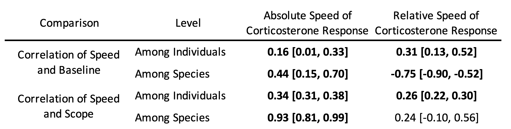

```{r setup, include=FALSE, echo = FALSE}
knitr::opts_chunk$set(echo = TRUE)

# This is loading packages used in the analyses below
pacman::p_load(ggplot2, here, tidyverse, viridis, gridExtra, simcoRt, png, sf, lme4, sjPlot, ape, phytools, brms, tidybayes, cowplot, grid)
```

*CCT & MNV: Department of Ecology & Evolutionary Biology and Lab of Ornithology, Cornell University*  
*JCW: Department of Neurobiology, Physiology, and Behavior, University of California-Davis*  


*Correspondance: Conor Taff; cct63@cornell.edu*  

\raggedright

## ABSTRACT

The acute glucocorticoid response is a key mediator of the coordinated vertebrate response to unpredictable challenges. Rapid glucocorticoid increases initiate changes that allow animals to cope with stressors. The scope of the glucocorticoid response — defined here as the absolute increase in glucocorticoids — is associated with individual differences in performance and varies across species with environment and life history. In addition to varying in scope, responses can differ enormously in speed; however, relatively little is known about whether speed and absolute glucocorticoid levels covary, how selection shapes speed, or what aspects of speed are important. We used corticosterone samples collected at 5 time points from 1,750 individuals of 60 species of birds to ask i) how the speed and scope of the glucocorticoid response covary and ii) whether variation in absolute or relative speed is predicted by environmental context or life history. Among species, faster absolute glucocorticoid responses were strongly associated with a larger scope. Despite this covariation, the relative speed of the glucocorticoid response (standardized within species) varied independently of absolute scope, suggesting that selection could operate on both features independently. Species with faster relative glucocorticoid responses lived in locations with more variable temperature and had shorter lifespans. Our results suggest that rapid changes associated with the speed of the glucocorticoid response, such as those occurring through non-genomic receptors, might be an important determinant of coping ability and we emphasize the need for studies designed to measure speed independently of absolute glucocorticoid levels.

*Keywords: stress, corticosterone, comparative physiology, evolutionary endocrinology*

## INTRODUCTION

Wild animals often encounter unpredictable and rapidly changing environmental conditions. For vertebrates, the glucocorticoid (GC) mediated stress response plays a primary role in coordinating phenotypic changes that allow animals to persist in challenging conditions [@sapolsky2000; @wingfield1998]. Decades of evidence now demonstrate that rapid changes in GC hormones can alter a variety of downstream traits including metabolism, behavior, gene expression, and physiology in ways that promote the avoidance or tolerance of stressors [@dallman2005; @datson2008; @wingfield1998; @sapolsky2000]. 

While the basic structure of the GC response system is highly conserved [@romero2019], individuals and species differ enormously in their absolute levels of circulating GCs under baseline and stress-induced conditions and in their regulation of GC levels [@vitousek2019; @romero2019]. Growing evidence suggests that observed differences in absolute GC levels among species reflect adaptation resulting from selection based on environmental context and life history [@vitousek2019; @williams2008; @cockrem2013; @breuner2008; @bonier2009; @schoenle2018]. However, in addition to varying in the scope of the GC response, individuals and species may vary in the speed of response (see definitions in Box 1). In contrast to absolute levels, relatively little is known about how selection shapes the speed of GC responses.

The speed of the GC response might be an important target of selection if it determines how quickly individuals can match their phenotype to changing conditions [@taff2016; @luttbeg2021]. Because the acute stress response is a multi-component system that includes a variety of downstream changes [@sapolsky2000], there will necessarily be a lag between the perception of any stressor and the production of the full stress-induced phenotype. Thus, a faster GC response should allow animals to more quickly match their phenotype with the prevailing environmental conditions [@taff2016]. At the same time, responding faster might incur costs that could be avoided with a slower response, because prolonged or chronic elevation of GC levels can result in a variety of well known costs [@korte2005]. Responding more slowly might allow animals to calibrate their response as additional information about a stressor is accumulated.

Disentangling the speed and scope of GC responses is challenging for several reasons. First, because the same physiological systems are involved in the speed and scope of the GC response, there are likely to be mechanistic links that create covariation between different attributes even when selection acts on only a single feature. For example, variation in FKBP5 expression could simultaneously alter the speed and magnitude of response [@zimmer2020fkbp5]. Second, selection may favor the coupling of particular speed and scope combinations even when there is no intrinsic mechanistic link. For example, Luttbeg et al [-@luttbeg2021] recently used optimality modeling of the speed of acute stress responses to show that altering GC regulation rate changes the optimal baseline and stress-induced GC levels under a variety of conditions. Finally, from a purely logistical perspective, separately measuring the speed and scope of stress responses is technically challenging [@taff2021]. In simulations across a range of conditions, the most commonly used study designs have much higher power to detect variation in scope even when substantial variation in speed exists [@taff2021]. Moreover, because variation in speed and scope can both contribute to differences in absolute GCs for a given sample (Box 1), variation in speed can be interpreted as variation in scope when samples are collected at standardized times [Figure \@ref(fig:concept-fig), @taff2021].

Given the challenge of measuring the speed of GC responses, it is not surprising that there is much more empirical evidence suggesting the importance of variation in scope [e.g., @vitousek2019; @schoenle2018]. However, there are also suggestions in the literature that variation in speed might differ in important ways among individuals in some situations. For example, wild great tits (*Parus major*) that were more cautious in a behavioral assay also had a faster increase in corticosterone during the three minutes after capture [@baugh2013; @baugh2017b]. A handful of other papers also report differences in aspects of the speed of GC responses between isogenic lines [@sadoul2015] or in relation to individual characteristics such as age and dominance [@sapolsky1993; @sapolsky1991], food availability [@heath1998], prior experience [@cockrem2013], or maternal condition [@weber2018]. In addition to variation among individuals, there is ample evidence that the time required to reach maximum GC levels differs with life history stage [@wingfield1992], among populations [@zimmer2020; @addis2011], and among species [@romero2005; @vitousekhormonebase], although these studies typically interpret variation primarily or exclusively in terms of scope.

Despite this evidence that the speed of the GC response varies and suggestions that this variation might be an important target of selection, there has been little effort to assemble a complete conceptual framework for predicting when faster or slower GC responses would be favored at either an individual or population level. In contrast, a wide range of conceptual and mathematical models have explored the conditions under which the scope of the GC response is expected to be larger or smaller [e.g., @wingfield1998; @romero2009; @taborsky2020]. These models have been applied to empirical data at both the among-species and among-individual levels [@vitousek2019; @schoenle2018; @jessop2013; @jessop2016; @bokony2009; @hau2010]. 

We had two linked goals, first we developed a set of hypotheses and predictions describing the conditions under which faster or slower GC responses should be favored. For this goal we borrowed heavily from existing frameworks for understanding variation in scope and translated these predictions to a set of hypotheses that might explain variation in speed of the GC response among individuals or populations (see below). We also evaluated support for predictions about how the speed and scope of GC responses covary among species and among individuals. 

The second and primary goal was to evaluate evidence for these hypotheses using a database of corticosterone measurements in birds. The data available were more appropriate for testing differences in speed of GC regulation among species and we focus on those comparisons, but we emphasize that each of our hypotheses could also apply at the among-individual level and that different patterns of covariation might occur at each level [@agrawal2020]. Finally, we lay out recommendations and directions for future study in this area. Throughout the paper, we focus on the acute GC response because most empirical data include measurements of this aspect of the stress response, but many of the hypotheses and ideas developed here will apply equally well to other components of the integrated stress response that change rapidly after encountering a stressor. Measuring multiple aspects of the acute stress response to evaluate whether a faster GC response always results in faster downstream changes in phenotype will be a fruitful area for future study.  

```{r concept-fig, echo = FALSE, message = FALSE, out.width = "75%", warning = FALSE, fig.align = "center", fig.cap = "Panel A illustrates the data available when only a baseline and stress-induced sample are collected (points) from each individual (different colors) during a standardized stressor protocol. Dashed lines are the inferred increase in glucocorticoids in the interval between sampling. Panel B-E illustrate four different patterns of true acute responses (solid lines) that could produce the same observed data from Panel A. Individuals might differ only in the scope of their response with no variation in speed (B) or they might differ in the speed of the response without differing in scope (C). Alternatively, individuals might differ in both speed and scope (D and E). Depending on the nature of variation in both attributes and the timing of sampling, data collected at two time points might still capture variation in speed and scope (D) or it might entirely misrepresent variation in speed and scope (E). Increasing the number of sampled time points per individual will result in more constrained response curves, but the consequences of different sampling schemes are rarely considered."}

# This conceptual figure is drawn and saved in another program and simply loaded here as an image.

knitr::include_graphics("speed_scope_figure.png", dpi = NA)

```

*Covariation in speed and scope* 

The speed and scope of endocrine responses could covary due to shared regulatory mechanisms, or as a result of selection operating simultaneously on both traits. Although phenotypic correlation does not necessarily equate to genetic correlation, absent or weak phenotypic correlation between these traits would suggest that they could be independently shaped by selection. Covariation between speed and scope is also important to understand because the particular patterns of covariation and relative amount of variation in each trait will have a strong effect on how well particular experimental designs can separately measure speed and scope [@taff2021]. A recent optimality model by Luttbeg et al. [-@luttbeg2021] revealed that slower GC responses lead to more similar baseline and stress-induced GC levels (i.e., a lower scope of response) when the increased lag time between encountering a stressor and responding appropriately elevates the likelihood of a mismatch between context and hormonal state. Here, we tested whether these predictions are supported at among-species and among-individual levels. Specifically, we tested whether individuals and species that mount a faster GC stress response have lower baseline GCs and a larger GC scope (maximum - baseline). While Luttbeg et al.'s [-@luttbeg2021] model considers corticosterone on a single scale, we evaluated covariation on both an absolute and relative (species centered) scale (see below and Box 1).

*The environmental and life history predictors of rapid GC responses*

We predict that selection will favor faster GC stress responses in environments in which significant challenges are common - and in which the effects of those challenges could be ameliorated by rapid hormone-mediated plasticity. This overarching hypothesis is similar to the “supportive” hypothesis previously proposed to explain variation in baseline GCs and the scope of the acute stress response [@vitousek2019]; however, we anticipate that the specific environmental and life history contexts that most strongly favor a rapid response versus a high scope response will differ. Because of the role of GCs in mediating thermoregulation through metabolic effects and the response to environmental challenges [e.g., @jessop2016; @debonne2008; @ruuskanen2021] we predict that: (1) faster GC responses will be favored in environments with greater thermal variability and/or unpredictability, and possibly also (2) in environments with greater variability or unpredictability in rainfall. We also predict that because smaller organisms generally have fewer energetic reserves, selection will favor (3) a more rapid GC stress response in smaller species. Similarly, when controlling for body size, we predict that (4) species with a higher metabolic rate (and thus higher total energetic demand) will mount faster GC stress responses. Note however that a positive covariation between metabolic rate and the speed of GC responses could also be a byproduct of the generally faster rate of biochemical processes that accompany high metabolic rates, rather than selection specifically favoring fast GC stress responses in these species.  

Because mounting a GC stress response imposes a variety of costs, selection may also favor a muted GC stress response in contexts in which these costs are likely to be particularly damaging (the “protective” hypothesis: Vitousek et al. 2019). If a slower GC stress response reduces the likelihood that a response will be triggered inappropriately by challenges that cease before the onset of GC-mediated plasticity, or provides individuals with more time to evaluate the nature of a challenge before responding, then slower responses may be especially beneficial in some contexts [@taff2016; @luttbeg2021]. We predict that because the acute GC stress response often impairs reproduction [e.g., @bokony2009; @sapolsky2000; @wingfield2003], (5) organisms engaging in high value reproductive attempts (those with fewer lifetime opportunities to reproduce) will mount slower stress responses during breeding. 

The nature of the challenges that organisms face are likely to affect the optimal speed of GC responses, in addition to their scope [e.g., @schoenle2018]. When predation and other extrinsic threats are variable in frequency, and when the risk of these threats can be mitigated by GC-induced plasticity, then we predict more rapid responses will be favored in populations that encounter these threats more often. Because data on the frequency or nature of threats faced by individuals in the populations measured here are not available we were not able to test this prediction directly. However, we tested the related prediction that (6) shorter-lived species (which generally face more extrinsic threats) will mount faster GC responses. Note however that this same relationship could reflect selection favoring slower responses in longer-lived species, which may be more susceptible to accumulated phenotypic damage resulting from high GC levels [@vitousek2019; @schoenle2021].  

# METHODS

*Database of corticosterone measurements*

We used a database of corticosterone measurements taken from species studied by the Wingfield Lab between 1988 and 2005 [@wingfield1992; @wingfield1995; @wingfield2018]. Most of these data have been published previously as parts of individual studies spanning the last several decades. Baseline and stress-induced corticosterone values for most species are also included in HormoneBase [@vitousekhormonebase], but that database does not include data from each time point used here. The field and laboratory methods for these studies are similar across species and are described in detail in a number of previous papers [@wingfield1992; @wingfield1995]. 

For all species, individuals were captured and a blood sample was taken in under three minutes followed by a standard stress restraint protocol with samples taken at multiple time points after capture. Most individuals were sampled at 5 separate time points (mean = 4.1 samples per individual). Samples were stored on ice in the field until plasma and red blood cells were separated by centrifugation in the lab and corticosterone concentration was assayed by radioimmunoassay [@wingfield1992; @wingfield1995]. No new data were collected in the present study. All sampling was approved by the appropriate agencies spanning a variety of institutions and locations.

Because we were interested in assessing variation in the speed of the corticosterone response, we restricted our analyses to species that had at least 5 individuals sampled for at least three different time points under 35 minutes after capture. For most species, samples were collected at <3 minutes, 5 minutes, 10 minutes, and 30 minutes. A few species had samples taken at 15 or 20 minutes in place of one of the other sampling times and a small number of samples were collected in between these standard times. The exact latency was recorded for all samples and often samples targeted to a specific time were actually collected a minute or two before or after the target time. We binned sampling times to determine species inclusion, but in all models we used the exact latency as a continuous predictor except in the case of some baseline samples (see explanation below). After filtering, our dataset included 60 species. Of these, 55 species also had at least 5 individuals sampled at a later time point (usually 60 minutes). Thus, most species in the dataset were sampled at five different time points during the hour after capture.

The database we used included information on mass, sampling date, and location of each individual. We matched these records with life history variables previously assembled in HormoneBase [as described in @johnson2018] to include average lifespan, number of clutches per year, age at maturity, and metabolic rate [@vitousekhormonebase]. Following Vitousek et al. (2019), we calculated the number of reproduction attempts as (average lifespan - age at maturity) x number of clutches per year. Previous analyses in the HormoneBase project used imputed metabolic rate and average lifespan from a phylogenetic reconstruction for species with missing data [@vitousek2019] using the R package `phylopars` [@phylopars]. We ran analyses both with and without imputed values. We report the analyses with imputed values but note any cases where results differed. 

Finally, we also used data from a previous HormoneBase analysis [@vitousek2019] at a population level to match corticosterone records with the amount of variation in precipitation and temperature at each location. Briefly, intra-season variation in temperature and precipitation was calculated as the standard deviation of daily temperature from a 51-year time series of global climate in 0.5$^\circ$ grids from the Climatic Research Unit [@harris2014] as described in Johnson et al. 2018. For these calculations, climate data were grouped into four three month intervals as follows: December-February, March-May, June-August, September-November [full details in @vitousek2019]. Individual capture records were matched to the climate data for the location and time period that they occurred in. Species level data were calculated by averaging climate data across each individual record included.

*Characterizing the speed of the corticosterone response*

The ideal way to separate variation in the speed of the corticosterone response from the absolute levels of corticosterone would be to fully estimate the response curve for each individual and species and compare all of the critical parameters and their correlations as suggested in Box 1. However, some of these parameters, such as the timing of the inflection point leading to a rapid increase after disturbance, would require many samples with fine temporal resolution and it is clear that the data available are insufficient to distinguish those differences. There is some evidence that individuals differ in the timing of initial activation [@baugh2017; @baugh2013] and it may be possible to measure these differences using approaches such as cannulated animals with repeated sampling or by measuring many individuals in a group or species at a mix of different time points rather than at standardized times [@taff2021], but our dataset is inappropriate for these questions. Instead, we focus our analyses on parameters that can plausibly be estimated given the data available, while recognizing that we cannot fully characterize variation in the functional shape of the response.

In contrast to inflection points, the slope of individual and species level increases and the absolute value of corticosterone at fixed time points can be reliably estimated with relatively few sampling points. We focused on estimating the absolute value of corticosterone at baseline along with the absolute or relative speed of increase in the first 15 minutes after disturbance. The absolute rate of increase during this time is likely a reasonable approximation of the maximum rate of increase (Box 1). To model the relative rate of increase, we centered and scaled all corticosterone measurements within each species. This allowed us to model species on a similar scale despite widely different ranges for the absolute values of corticosterone, where the slope represents the maximum rate of increase measured in units of within species standard deviations. Modeling on this relative scale yields estimates of the increase in species standard deviations per unit time and is therefore a reasonable approximation for the time required to reach a given percentage of the species maximum value (Box 1). Individuals and species that come closer to reaching the species maximum value of corticosterone in the first 15 minutes after disturbance will have a faster speed (assessed by random slope estimate) on this relative scale. Corticosterone responses vary enormously in magnitude between contexts and among species, but downstream responses can be achieved independently of absolute values due to differences in sensitivity; thus, the speed of relative corticosterone increase may be a better predictor of the rapid activation of the integrated stress response in many cases.

For most species, limiting samples to the first 15 minutes included sampling time points at approximately 1, 5, and 10 minutes with a few species instead having a sampling point at 15 minutes. We chose to focus on samples taken in the first 15 minutes rather than all time points for several reasons. First, corticosterone values increased approximately linearly over this time period, making it possible to estimate slopes without requiring transformations or non-linear fits (Figure \@ref(fig:all-comp)). While log transformation might have resulted in a linear increase over a longer time period, it would make it difficult to evaluate differences in the speed of response, because on a log scale the same absolute rate of increase would differ in slope depending on baseline corticosterone. We caution that studies interested in disentangling speed and scope will need to be very careful about the application and interpretation of transformations.

Second, the maximum rate of corticosterone increase occurs in the first few minutes after a disturbance (Box 1) and this maximum rate should be best captured by the linear slope early in the response. Third, the slope over the entire sampling period may be related to maximum and baseline levels for purely mathematical reasons, especially when the exact time of individual and species maximum values are not estimable (e.g., if samples are only available at the exact same two time points, then slope will be mathematically identical to the scope, Figure \@ref(fig:concept-fig)). Finally, because we could not reliably estimate the exact time needed to reach maximum values with the available data, slopes using the full time course will include a mix of samples taken before and after the maximum and the offset of these samples from the maximum time may differ among individuals and species. When plotting raw data for each species, maximum values were always reached more than 15 minutes after disturbance (Figure \@ref(fig:all-comp)) and using this time cutoff ensured that we were comparing species based on the slope of initial increase before reaching their maximum.

We used the full time course of samples to calculate an estimate for the scope of response for each individual (maximum - minimum at any time points). This scope was used in bivariate models exploring correlations between the speed and scope of the corticosterone response among species and among individuals, but was not included in the life history models.

*Considerations for estimating baseline corticosterone*

In order to model correlations between the speed and absolute values of the corticosterone response we parameterized models so that the intercept corresponded to the approximate baseline level. This strategy allowed us to directly evaluate correlations between random slopes and intercepts themselves and between random estimates and life history covariates at both individual and species levels within the same models while appropriately accounting for the uncertainty in random effect estimation [@houslay2017]. Fitting models with this strategy required us to make decisions about baseline values that are somewhat subjective.

We needed to account for the fact that there is a lag between capture and the detection of higher circulating corticosterone [@wingfield1998]. For birds, this lag time is often considered to be 3 minutes [@small2017], but the exact time is not known with precision and individuals or species could vary in the length of this time lag [@baugh2013; @baugh2017]. As described above, we cannot estimate differences in time lags given our data. Instead, we assumed a standard time lag of 2 minutes and counted any samples taken in under 2 minutes as baseline (set to a latency of 0 in our models). Using this approach, the intercept in our baseline models represented estimated corticosterone 2 minutes after capture. We performed a sensitivity analysis using a time lag of 1 minute or 3 minutes and all results were qualitatively similar. We acknowledge that this approach does not account for differences in time lags. If time lags vary systematically with speed (e.g., shorter time lag correlated with steeper initial slope), then some of the effects we detect could be associated with time lags rather than slope, but it is impossible to model those patterns with the data presently available.

*Data analysis*

```{r load-data, echo = FALSE, message = FALSE, warning = FALSE}

## Now load in the data. There is a long version and a wide version.
  
  dl <- read.delim(here::here("1_raw_data", "raw_data_long.txt"))
  dw <- read.delim(here::here("1_raw_data", "raw_data_wide.txt"))
  dl$latency.s <- scale(dl$latency)

## Fix some column types
  
  dl$cort <- as.numeric(as.character(dl$cort))
  
## summarize number of samples per species by time bin
  
    dl$rn_lat <- ceiling(dl$latency)
    dl$rn_lat_bin <- 5 * ceiling(dl$rn_lat / 5)
  
  # save only ones with a valid cort measure    
    dlx <- subset(dl, is.na(dl$cort) == FALSE)
    dlf <- dlx %>%
      group_by(alpha, rn_lat_bin) %>%
      summarise(cort_mu = mean(cort), n = n()) 
  
  # count the number of observations in each bin    
    dlf2 <- pivot_wider(dlf, id_cols = "alpha", names_from = "rn_lat_bin", names_prefix = "bin_", names_sep = "_", values_from = "n")
    dlf3 <- as.data.frame(dlf2[, c("alpha", "bin_5", "bin_10", "bin_15", "bin_20", "bin_25", "bin_30", "bin_35", 
                                   "bin_50", "bin_55", "bin_60", "bin_65", "bin_70", "bin_75", "bin_120")])
    lim <- 4  # set limit for how many observations needed to include species
    dlf3[is.na(dlf3)] <- 0
    for(i in 1:nrow(dlf3)){
      ifelse(dlf3$bin_5[i] > lim, dlf3$b5[i] <- 1, dlf3$b5[i] <- 0)
      ifelse(dlf3$bin_10[i] > lim, dlf3$b10[i] <- 1, dlf3$b10[i] <- 0)
      ifelse(dlf3$bin_15[i] > lim, dlf3$b15[i] <- 1, dlf3$b15[i] <- 0)
      ifelse(dlf3$bin_20[i] > lim, dlf3$b20[i] <- 1, dlf3$b20[i] <- 0)
      ifelse(dlf3$bin_25[i] > lim, dlf3$b25[i] <- 1, dlf3$b25[i] <- 0)
      ifelse(dlf3$bin_30[i] > lim, dlf3$b30[i] <- 1, dlf3$b30[i] <- 0)
      ifelse(dlf3$bin_35[i] > lim, dlf3$b35[i] <- 1, dlf3$b35[i] <- 0)
      ifelse(dlf3$bin_60[i] > lim, dlf3$b60[i] <- 1, dlf3$b60[i] <- 0)
      ifelse(dlf3$bin_65[i] > lim, dlf3$b65[i] <- 1, dlf3$b65[i] <- 0)
      ifelse(dlf3$bin_70[i] > lim, dlf3$b70[i] <- 1, dlf3$b70[i] <- 0)
      ifelse(dlf3$bin_75[i] > lim, dlf3$b75[i] <- 1, dlf3$b75[i] <- 0)
      ifelse(dlf3$bin_120[i] > lim, dlf3$b120[i] <- 1, dlf3$b120[i] <- 0)
    }
    dlf3$sam_periods35 <- dlf3$b5 + dlf3$b10 + dlf3$b15 + dlf3$b20 + dlf3$b25 + dlf3$b30 + dlf3$b35 
    dlf3$sam_periods60 <- dlf3$b60 + dlf3$b65 + dlf3$b70 + dlf3$b75 + dlf3$b120
    
    dlf4 <- subset(dlf3, dlf3$sam_periods35 > 2)  
  
  # subset initial dataset to the species identified here
    dlf5 <- dlx[dlx$alpha %in% unique(dlf4$alpha), ]
      
    dlf5 <- subset(dlf5, is.na(dlf5$latency) == FALSE)
    dlf5 <- subset(dlf5, dlf5$latency < 70)

```

```{r add-hb-covars, echo = FALSE, message = FALSE, warning = FALSE}
# join the hormonebase covariates
  hbd <- read.delim(here::here("1_raw_data", "hb_covariates.txt"))
  
# join to the long data in the same way
  dlf5$wing_com_nm <- dlf5$com_nm
  dlf5b <- plyr::join(dlf5, hbd, "wing_com_nm")
  dlf5b$mass <- as.numeric(dlf5b$mass)
  
  dlf5b$hb_gen_sp <- as.factor(dlf5b$hb_gen_sp)
```

```{r add-environment, echo = FALSE, message = FALSE, warning = FALSE}

# This saved file has the population ID for each wingfield location to match with records from HormoneBase. Was compiled by calculating distances,
  # all are less than 15m different from hormonebase populatoin centers.
    hb_pop_list <- read.delim(here::here("1_raw_data/hb_pop_match.csv"), sep = ",")


# # Join the population to the filtered wingfield data
#   dlf7$dupcheck <- paste(dlf7$hb_gen_sp, dlf7$lat, dlf7$long, sep = "_")
#   dlf7 <- plyr::join(dlf7, hb_pop_list, "dupcheck")
#   
# # Determine if sample is from fall/winter/spring/summer 
#     dlf7$season <- NA
#     for(i in 1:nrow(dlf7)){
#       if(is.na(dlf7$doy[i]) == FALSE){
#         if(dlf7$doy[i] >= 335 | dlf7$doy[i] <= 59){dlf7$season[i] <- "Winter"}
#         if(dlf7$doy[i] >= 60 & dlf7$doy[i] <= 151){dlf7$season[i] <- "Spring"}
#         if(dlf7$doy[i] >= 152 & dlf7$doy[i] <= 243){dlf7$season[i] <- "Summer"}
#         if(dlf7$doy[i] >= 244 & dlf7$doy[i] <= 334){dlf7$season[i] <- "Fall"}
#       }
#     }
  
## Load in HormoneBase environment data and join by population and season
      hb_env <- read.delim(here::here("1_raw_data", "hb_environment_vars.txt"))
      hb_env$pop_ssn <- paste(hb_env$pop_id, hb_env$season, sep = "_")
      
      # dlf7$pop_ssn <- paste(dlf7$hb_pop_id, dlf7$season, sep = "_")
      # dlf7 <- plyr::join(dlf7, hb_env, "pop_ssn", "left", "first")
      
# do the same as above for the long data
      dlf5b$dupcheck <- paste(dlf5b$hb_gen_sp, dlf5b$lat, dlf5b$long, sep = "_")
      dlf5b <- plyr::join(dlf5b, hb_pop_list, "dupcheck")
      dlf5b$season <- NA
    for(i in 1:nrow(dlf5b)){
      if(is.na(dlf5b$doy[i]) == FALSE){
        if(dlf5b$doy[i] >= 335 | dlf5b$doy[i] <= 59){dlf5b$season[i] <- "Winter"}
        if(dlf5b$doy[i] >= 60 & dlf5b$doy[i] <= 151){dlf5b$season[i] <- "Spring"}
        if(dlf5b$doy[i] >= 152 & dlf5b$doy[i] <= 243){dlf5b$season[i] <- "Summer"}
        if(dlf5b$doy[i] >= 244 & dlf5b$doy[i] <= 334){dlf5b$season[i] <- "Fall"}
      }
    }
      
      dlf5b$pop_ssn <- paste(dlf5b$hb_pop_id, dlf5b$season, sep = "_")
      dlf5b <- plyr::join(dlf5b, hb_env, "pop_ssn", "left", "first")

```

```{r sum-to-sp, echo = FALSE, message = FALSE, warning = FALSE}
# This chunk is summarizing the full dataset down to species level (one row per species)

# calculate brood value as in Vitousek et al 2019 ----
  # same for the long data
      for(i in 1:nrow(dlf5b)){
          mats <- na.omit(c(dlf5b$ft_matur[i], dlf5b$mt_matur[i]))
          dlf5b$mature[i] <- mean(mats) / 365
        }
        dlf5b$rep_val <- (dlf5b$avg_long - dlf5b$mature) * dlf5b$clutch_year
        dlf5b$rep_val_i <- (dlf5b$av_long_i - dlf5b$mature) * dlf5b$clutch_year


 
## Same as above but for breeding records only ----  
  # read in breeding stage by date for each species and wrangle into matching format
    bstg <- read.delim(here::here("1_raw_data", "breed_stages.txt"))
    bstg2 <- bstg %>%
      pivot_longer(cols = c("dec_feb", "mar_may", "jun_aug", "sep_nov"), names_to = "mnth_rng", values_to = "brdg_stg")
    mn_to_ssn <- data.frame(mnth_rng = c("dec_feb", "mar_may", "jun_aug", "sep_nov"), 
                            season = c("Winter", "Spring", "Summer", "Fall"))
    bstg2 <- plyr::join(bstg2, mn_to_ssn, "mnth_rng", "left")
    bstg2$sp_stg <- paste(bstg2$species, bstg2$season, sep = " ")
    bstg3 <- bstg2[, c("sp_stg", "brdg_stg")]
    
  # join breeding stage to data
    dlf5b$sp_stg <- paste(dlf5b$hb_gen_sp, dlf5b$season, sep = " ")
    dlf5b <- plyr::join(dlf5b, bstg3, "sp_stg")
    
  
      
    
```

```{r model-setup, echo = FALSE, warning = FALSE, message = FALSE}

# Set up for mcmcglmm models ----
    phylo <- read.nexus(here::here("1_raw_data", "bird_trees", "output.nex"))     # tree download from teh bird tree website
    phy1 <- phylo[[1]]    # Running with the first tree. I downloaded 100, could loop through and run more if needed.
    inv.phy1 <- MCMCglmm::inverseA(phy1, nodes = "TIPS", scale = TRUE)
    
    
    dlf5b2 <- subset(dlf5b, is.na(dlf5b$btree) == FALSE & dlf5b$btree != "")
    dlf5b2$btree <- gsub(" ", "_", dlf5b2$btree)
    dlf5b2 <- subset(dlf5b2, is.na(dlf5b2$cort) == FALSE & is.na(dlf5b2$latency) == FALSE)
    
# set up some columns needed for models
    dlf5b2$l_cort <- log(dlf5b2$cort)
    dlf5b2$latency2 <- dlf5b2$latency - 3
    dlf5b2$latency_alt <- dlf5b2$latency - 1  # used for sensitivity test with intercept at 1 minute
    
    for(i in 1:nrow(dlf5b2)){
      if(dlf5b2$latency[i] > 16){dlf5b2$slp_bin[i] <- "B"}
      if(dlf5b2$latency[i] <= 16){dlf5b2$slp_bin[i] <- "A"}
      if(dlf5b2$latency2[i] < 0){dlf5b2$latency2[i] <- 0}
      if(dlf5b2$latency_alt[i] < 0){dlf5b2$latency_alt[i] <- 0}
    }
    dlf5b2$latency3 <- dlf5b2$latency2 - 30
    dlf5b2$latency3_alt1 <- dlf5b2$latency2 - 20
    dlf5b2$latency3_alt2 <- dlf5b2$latency2 - 40
    dlf5b2$btree2 <- dlf5b2$btree
    
## centered within species from 0 to 1 ----
  for(i in 1:nrow(dlf5b2)){
    sub <- subset(dlf5b2, dlf5b2$btree2 == dlf5b2$btree2[i])
    muc <- mean(sub$cort)
    sdc <- sd(sub$cort)
    dlf5b2$cort_s[i] <- (dlf5b2$cort[i] - muc) / sdc
  }
    
    tdf <- data.frame(ind_id = unique(dlf5b2$ind_id),
                       scope = NA)
# calculate scope for each individual
    for(i in 1:nrow(tdf)){
      sub <- subset(dlf5b2, dlf5b2$ind_id == tdf$ind_id[i])
      x1 <- max(sub$cort)
      x2 <- min(sub$cort)
      tdf$scope[i] <- x1 - x2
    }
    

    
    dlf5b2 <- plyr::join(dlf5b2, tdf, "ind_id", "left", "first")
    #dlf5b2$scope_dup <- paste(dlf5b2$ind_id, dlf5b2$scope, sep = "_")
    #dlf5b2$scope[duplicated(dlf5b2$scope_dup)] <- NA   # this doesn't work for bivariate because it removes the whole record
    
        # scale scope within species
      for(i in 1:nrow(dlf5b2)){
        sub <- subset(dlf5b2, dlf5b2$btree2 == dlf5b2$btree2[i])
        mus <- mean(sub$scope)
        sds <- sd(sub$scope)
        dlf5b2$scope_s[i] <- (dlf5b2$scope[i] - mus) / sds
      }

# set up phylogeny for brms
  A <- ape::vcv.phylo(phy1)
  
# set up values used for model fits in brms that are passed to stan  
  numchains <- 4
  numcores <- 4
  numits <- 4000
  numwarm <- 1000
    


```

```{r init-model, echo = FALSE, message = FALSE, warning = FALSE}

# These allow for looking at individual and species level covariation between speed and scope

# the if statement here is telling the code whether to run the full model again, otherwise it is loaded from a saved object (faster)
    runner <- "no"
    if(runner == "yes"){
      
        dlf5b2$under15 <- 0
        for(i in 1:nrow(dlf5b2)){if(dlf5b2$slp_bin[i] == "A"){dlf5b2$under15[i] <- 1}}
        dlf5b2 <- dlf5b2[order(dlf5b2$latency2), ]
        dlf5b2$scope_u <- 0
        dlf5b2[!duplicated(dlf5b2$ind_id), "scope_u"] <- 1
    
      # Initial model as a bivariate analyzing standardized cort slope and scope (centered and standardized within species)
          f1_mcb1a <- bf(cort_s | subset(under15) ~ 0 + (1 + latency2|ind_id) + (1 + latency2|q|gr(btree, cov = A)))
          f2_mcb1a <- bf(scope | subset(scope_u) ~ 0 + (1|q|gr(btree, cov = A)))
          fmcb1a <- brm(f1_mcb1a + f2_mcb1a + set_rescor(FALSE), data = dlf5b2,
                       data2 = list(A = A),
                       warmup = 1000, iter = 8000, control = list(max_treedepth = 12, adapt_delta = 0.9), chains = 4, cores = 4)
          
          #saveRDS(fmcb1a, here::here("5_other_outputs", "fmcb1a.rds"))
       
      # Initial model as a bivariate analyzing raw cort slope and scope       
          f1_mcb1 <- bf(cort | subset(under15) ~ 0 + (1 + latency2|ind_id) + (1 + latency2|q|gr(btree, cov = A)))
          f2_mcb1 <- bf(scope | subset(scope_u) ~ 0 + (1|q|gr(btree, cov = A)))
          fmcb1b <- brm(f1_mcb1 + f2_mcb1 + set_rescor(FALSE), data = dlf5b2,
                       data2 = list(A = A),
                       warmup = 1000, iter = 8000, control = list(max_treedepth = 12, adapt_delta = 0.9), chains = 4, cores = 4)
          
          #saveRDS(fmcb1b, here::here("5_other_outputs", "fmcb1b.rds"))
    }

```

```{r hypo-mods, message = FALSE, warning = FALSE, echo = FALSE}

runner <- "yes"  # actual models are commented out to save time, this loads some data for plotting
if(runner == "yes"){

## Model for intra-season temperature variability ----
      # set up the subset of data
          mh1_nona <- dlf5b2[, c("ind_id", "btree", "cort", "l_cort", "scope_s",
                                 "temp_intra_sd", "latency", "latency2", "btree2", "cort_s")]
          mh1_nona <- na.omit(mh1_nona)
          mh1_nona$ind_id <- as.factor(mh1_nona$ind_id)
          mh1_nona <- subset(mh1_nona, mh1_nona$latency2 <= 16)

      # # bivariate model
      #         f1_mh1 <- bf(cort_s ~ 1 + latency2 + (1|ind_id) + (1 + latency2|q|gr(btree, cov = A)))
      #         f1_mh1b <- bf(cort ~ 1 + latency2 + (1|ind_id) + (1 + latency2|q|gr(btree, cov = A)))
      #         f2_mh1 <- bf(temp_intra_sd ~ 0 + (1|q|gr(btree, cov = A)))
      #         prior1 <- prior_string("normal(0,2)", class = "sd", coef = "Intercept", resp = "tempintrasd", group = "btree")
      #         mh1s <- brm(f1_mh1 + f2_mh1 + set_rescor(FALSE), data = mh1_nona,
      #                   data2 = list(A = A), prior = prior1, control = list(adapt_delta = 0.9),
      #                   warmup = numwarm, iter = numits, chains = numchains, cores = 4)
      #         mh1a <- brm(f1_mh1b + f2_mh1 + set_rescor(FALSE), data = mh1_nona,
      #                   data2 = list(A = A), prior = prior1,
      #                   warmup = numwarm, iter = numits, chains = numchains, cores = 4)
      # 
      #         saveRDS(mh1s, here::here("5_other_outputs", "mh1s.rds"))
      #         saveRDS(mh1a, here::here("5_other_outputs", "mh1a.rds"))
  
## Model for intra-season precipitation variability ----
      # set up the subset of data
          mh2_nona <- dlf5b2[, c("ind_id", "btree", "cort", "l_cort",
                                 "prec_intra_sd", "latency", "latency2", "btree2", "cort_s")]
          mh2_nona <- na.omit(mh2_nona)
          mh2_nona$ind_id <- as.factor(mh2_nona$ind_id)
          mh2_nona <- subset(mh2_nona, mh2_nona$latency2 <= 16)
          
      # # bivariate model
      #     f1_mh2 <- bf(cort_s ~ 1 + latency2 + (1|ind_id) + (1 + latency2|q|gr(btree, cov = A)))    
      #     f1_mh2b <- bf(cort ~ 1 + latency2 + (1|ind_id) + (1 + latency2|q|gr(btree, cov = A)))
      #     f2_mh2 <- bf(prec_intra_sd ~ 0 + (1|q|gr(btree, cov = A)))
      #     prior2 <- prior_string("normal(0,5)", class = "sd", coef = "Intercept", resp = "precintrasd", group = "btree")
      #     mh2s <- brm(f1_mh2 + f2_mh2 + set_rescor(FALSE), data = mh2_nona,
      #               data2 = list(A = A), prior = prior2, control = list(max_treedepth = 12, adapt_delta = 0.95),
      #               warmup = numwarm, iter = numits + 2000, chains = numchains, cores = 4)
      #     mh2a <- brm(f1_mh2b + f2_mh2 + set_rescor(FALSE), data = mh2_nona,
      #               data2 = list(A = A), prior = prior2, control = list(adapt_delta = 0.95),
      #               warmup = numwarm, iter = numits, chains = numchains, cores = 4)
      #     
      #   saveRDS(mh2s, here::here("5_other_outputs", "mh2s.rds"))
      #   saveRDS(mh2a, here::here("5_other_outputs", "mh2a.rds"))
        
## Model for mass ----
      # set up the subset of data
          mh3_nona <- dlf5b2[, c("ind_id", "btree", "cort", "l_cort",
                                 "mass", "latency", "latency2", "btree2", "cort_s")]
          mh3_nona <- na.omit(mh3_nona)
          mh3_nona$ind_id <- as.factor(mh3_nona$ind_id)
          mh3_nona <- subset(mh3_nona, mh3_nona$latency2 <= 16)
          
      # # bivariate model
      #     f1_mh3a <- bf(cort ~ 1 + latency2 + (1|ind_id) + (1 + latency2|q|gr(btree, cov = A)))
      #     f1_mh3 <- bf(cort_s ~ 1 + latency2 + (1|ind_id) + (1 + latency2|q|gr(btree, cov = A)))
      #     f2_mh3 <- bf(scale(log(mass)) ~ 0 + (1|q|gr(btree, cov = A)))
      #     mh3s <- brm(f1_mh3 + f2_mh3 + set_rescor(FALSE), data = mh3_nona,
      #                  data2 = list(A = A),
      #                  warmup = numwarm, iter = numits, control = list(max_treedepth = 12, adapt_delta = 0.9), chains = numchains, cores = 4)
      #     mh3a <- brm(f1_mh3a + f2_mh3 + set_rescor(FALSE), data = mh3_nona,
      #                  data2 = list(A = A),
      #                  warmup = numwarm, iter = numits, control = list(max_treedepth = 12, adapt_delta = 0.95), chains = numchains, cores = 4)
      #     
      #     saveRDS(mh3s, here::here("5_other_outputs", "mh3s.rds"))
      #     saveRDS(mh3a, here::here("5_other_outputs", "mh3a.rds"))
          
## Model for longevity ----
      # set up the subset of data
          mh4_nona <- dlf5b2[, c("ind_id", "btree", "cort", "l_cort",
                                 "av_long_i", "latency", "latency2", "btree2", "cort_s")]
          mh4_nona <- na.omit(mh4_nona)
          mh4_nona$ind_id <- as.factor(mh4_nona$ind_id)
          mh4_nona <- subset(mh4_nona, mh4_nona$latency2 <= 16)
          mh4_nona$uniq_sp <- 0
          mh4_nona[!duplicated(mh4_nona$btree2), "uniq_sp"] <- 1

      # smaller subset with no inferred values
          mh4_nona2 <- dlf5b2[, c("ind_id", "btree", "cort", "l_cort",
                             "avg_long", "latency", "latency2", "btree2", "cort_s")]
          mh4_nona2 <- na.omit(mh4_nona2)
          mh4_nona2$ind_id <- as.factor(mh4_nona2$ind_id)
          mh4_nona2 <- subset(mh4_nona2, mh4_nona2$latency2 <= 16)
          mh4_nona2$uniq_sp <- 0
          mh4_nona2[!duplicated(mh4_nona2$btree2), "uniq_sp"] <- 1
          
      
      # this model only has single lifespan estimate per species, so i can't model bivariate in the same way as above
          # because there is no way to estimate uncertainty in species lifespan estimates. Instead, I'm fitting the 
          # cort part of the model and then manually calculating correlations with lifespan estimates below using the full posterior
          # I have also fit these excluding species with inferred lifespans and results are similar (not shown)
      # # model for cort component.  
      #     f1_mh4a <- bf(cort ~ 1 + latency2 + (1|ind_id) + (1 + latency2|gr(btree, cov = A)))
      #     f1_mh4 <- bf(cort_s ~ 1 + latency2 + (1|ind_id) + (1 + latency2|gr(btree, cov = A)))
      # 
      #     mh4s1 <- brm(f1_mh4, data = mh4_nona,
      #        data2 = list(A = A),
      #        warmup = numwarm, iter = numits, chains = numchains, cores = numcores)
      # 
      #     mh4a1 <- brm(f1_mh4a, data = mh4_nona,
      #                  data2 = list(A = A),
      #                  warmup = numwarm, iter = numits, chains = numchains, cores = numcores)
      # 
      # # save the models
      #   saveRDS(mh4s1, here::here("5_other_outputs", "mh4s1.rds"))
      #   saveRDS(mh4a1, here::here("5_other_outputs", "mh4a1.rds"))
        
## Model for metabolic rate ----
      # set up the subset of data
          mh5_nona <- dlf5b2[, c("ind_id", "btree", "cort", "l_cort",
                                 "mr_infer", "mass", "latency", "latency2", "btree2", "cort_s")]
          mh5_nona <- na.omit(mh5_nona)
          mh5_nona$ind_id <- as.factor(mh5_nona$ind_id)
          mh5_nona <- subset(mh5_nona, mh5_nona$latency2 <= 16)
          mh5_nona$uniq_sp <- 0
          mh5_nona[!duplicated(mh5_nona$btree2), "uniq_sp"] <- 1
          for(i in 1:nrow(mh5_nona)){
            mh5_nona$mass2[i] <- mean(subset(mh5_nona$mass, mh5_nona$btree == mh5_nona$btree[i]))
          }

      # smaller subset with no inferred values
          mh5_nona2 <- dlf5b2[, c("ind_id", "btree", "cort", "l_cort",
                             "mr", "mass", "latency", "latency2", "btree2", "cort_s")]
          mh5_nona2 <- na.omit(mh5_nona2)
          mh5_nona2$ind_id <- as.factor(mh5_nona2$ind_id)
          mh5_nona2 <- subset(mh5_nona2, mh5_nona2$latency2 <= 16) 
          mh5_nona2$uniq_sp <- 0
          mh5_nona2[!duplicated(mh5_nona2$btree2), "uniq_sp"] <- 1
          for(i in 1:nrow(mh5_nona2)){
            mh5_nona2$mass2[i] <- mean(subset(mh5_nona2$mass, mh5_nona2$btree == mh5_nona2$btree[i]))
          }
          
      # this model only has single metabolic rate estimate per species, so i can't model bivariate in the same way as above
          # because there is no way to estimate uncertainty in species mr estimates. Instead, I'm fitting the 
          # cort part of the model and then manually calculating correlations with mr estimates below using the full posterior
          # I have also fit these excluding species with inferred mr and results are similar (not shown)
      # # model for cort component.  
      #     f1_mh5a <- bf(cort ~ 1 + latency2 + (1|ind_id) + (1 + latency2|gr(btree, cov = A)))
      #     f1_mh5 <- bf(cort_s ~ 1 + latency2 + (1|ind_id) + (1 + latency2|gr(btree, cov = A)))
      #     
      #     mh5s1 <- brm(f1_mh5, data = mh5_nona,
      #        data2 = list(A = A),
      #        warmup = numwarm, iter = numits, chains = numchains, cores = numcores)
      #     
      #     mh5a1 <- brm(f1_mh5a, data = mh5_nona,
      #                  data2 = list(A = A),
      #                  warmup = numwarm, iter = numits, chains = numchains, cores = numcores)
      #     
      # # save the models
      #   saveRDS(mh5s1, here::here("5_other_outputs", "mh5s1.rds"))   
      #   saveRDS(mh5a1, here::here("5_other_outputs", "mh5a1.rds"))
      #  
      # # Make the mass corrected metabolic rate column
      #   mh5_nona$mr_mass <- residuals(lm(mh5_nona$mr_infer ~ mh5_nona$mass2))
        
## Model for repro value ----
      # set up the subset of data
          # sub to breeding stage only
              dlf5b2_br <- subset(dlf5b2, dlf5b2$brdg_stg == "breed")

              mh6_nona <- dlf5b2_br[, c("ind_id", "btree", "cort", "l_cort",
                                     "rep_val_i", "latency", "latency2", "btree2", "cort_s")]
              mh6_nona <- na.omit(mh6_nona)
              mh6_nona$ind_id <- as.factor(mh6_nona$ind_id)
              mh6_nona <- subset(mh6_nona, mh6_nona$latency2 <= 16)
              mh6_nona$uniq_sp <- 0
              mh6_nona[!duplicated(mh6_nona$btree2), "uniq_sp"] <- 1

          # smaller subset with no inferred values
              mh6_nona2 <- dlf5b2_br[, c("ind_id", "btree", "cort", "l_cort",
                                 "rep_val", "latency", "latency2", "btree2", "cort_s")]
              mh6_nona2 <- na.omit(mh6_nona2)
              mh6_nona2$ind_id <- as.factor(mh6_nona2$ind_id)
              mh6_nona2 <- subset(mh6_nona2, mh6_nona2$latency2 <= 16)
              mh6_nona2$uniq_sp <- 0
              mh6_nona2[!duplicated(mh6_nona2$btree2), "uniq_sp"] <- 1
              
      # this model only has single metabolic rate estimate per species, so i can't model bivariate in the same way as above
          # because there is no way to estimate uncertainty in species mr estimates. Instead, I'm fitting the 
          # cort part of the model and then manually calculating correlations with mr estimates below using the full posterior
          # I have also fit these excluding species with inferred mr and results are similar (not shown)
      # # model for cort component.  
      #     f1_mh6a <- bf(cort ~ 1 + latency2 + (1|ind_id) + (1 + latency2|gr(btree, cov = A)))
      #     f1_mh6 <- bf(cort_s ~ 1 + latency2 + (1|ind_id) + (1 + latency2|gr(btree, cov = A)))
      #     
      #     mh6s1 <- brm(f1_mh6, data = mh6_nona,
      #        data2 = list(A = A),
      #        warmup = numwarm, iter = numits, chains = numchains, cores = numcores)
      #     
      #     mh6a1 <- brm(f1_mh6a, data = mh6_nona,
      #                  data2 = list(A = A),
      #                  warmup = numwarm, iter = numits, chains = numchains, cores = numcores)
      #     
      # # save the models
      #   saveRDS(mh6s1, here::here("5_other_outputs", "mh6s1.rds"))   
      #   saveRDS(mh6a1, here::here("5_other_outputs", "mh6a1.rds"))      
              
            
  

}              
```

```{r load-models, echo = FALSE, message = FALSE, warning = FALSE}

loader <- "no"  # should all the fit models be loaded

if(loader == "yes"){

# Models are all fit and saved in chunks above, but take a while to run. Saved versions are in here and are loaded

# Covariation between intercept and slope models
      fmcb1a <- readRDS(here::here("5_other_outputs", "fmcb1a.rds"))          # this one uses species centered/stnd cort
      fmcb1b <- readRDS(here::here("5_other_outputs", "fmcb1b.rds"))          # this one uses raw/absolute cort

# Life history hypothesis models (s for scaled cort a for absolute cort)
  # temperature
      mh1s <- readRDS(here::here("5_other_outputs", "mh1s.rds"))             # ok
      mh1a <- readRDS(here::here("5_other_outputs", "mh1a.rds"))             # ok
  # precipitation
      mh2s <- readRDS(here::here("5_other_outputs", "mh2s.rds"))             # ok
      mh2a <- readRDS(here::here("5_other_outputs", "mh2a.rds"))             # ok
  # mass
      mh3s <- readRDS(here::here("5_other_outputs", "mh3s.rds"))             # ok
      mh3a <- readRDS(here::here("5_other_outputs", "mh3a.rds"))             # ok
  # longevity [only one obs per species, correlation manually calculated from posterior]
      mh4a1 <- readRDS(here::here("5_other_outputs", "mh4a1.rds"))           # ok
      mh4s1 <- readRDS(here::here("5_other_outputs", "mh4s1.rds"))           # ok
  # metabolic rate [only one obs per species, correlation manually calculated from posterior]
      mh5a1 <- readRDS(here::here("5_other_outputs", "mh5a1.rds"))           # ok
      mh5s1 <- readRDS(here::here("5_other_outputs", "mh5s1.rds"))           # ok
  # reproductive value [only one obs per species, correlation manually calculated from posterior]
      mh6a1 <- readRDS(here::here("5_other_outputs", "mh6a1.rds"))           # ok
      mh6s1 <- readRDS(here::here("5_other_outputs", "mh6s1.rds"))           # ok
}
```

```{r covar-plots, echo = FALSE, message = FALSE, warning = FALSE, fig.height = 5.1, fig.width = 7.3, fig.cap = "Posterior distribution for the correlation between the the among-species or among-individual slope in the first 15 minutes after disturbance and the estimated baseline (intercept) or scope (maximum - minimum from full time course) of the corticosterone response. Plots are derived from two similar bivariate models using either absolute increase in corticosterone in the first 15 minutes or species centered and standardized increase in corticosterone in the first 15 minutes."}
  draws <- 2000

# This was set up to make some plots of covariation, but I am currently just including those in a summary table so it is not run.

runner <- "no"
if(runner == "yes"){
## Putting together a dataframe to store correlations for each estimate for plotting
    sp_cor_sp_sc_a <- fmcb1b %>%
      spread_draws(cor_btree__cort_latency2__scope_Intercept, seed = 972, ndraws = draws)
    colnames(sp_cor_sp_sc_a) <- c("chain", "iteration", "draw", "cor")
    sp_cor_sp_sc_a$model <- "absolute"
    sp_cor_sp_sc_a$comp <- "speed_vs_scope"
    sp_cor_sp_sc_a$level <- "among_species"
    
    sp_cor_sp_ba_a <- fmcb1b %>%
      spread_draws(cor_btree__cort_Intercept__cort_latency2, seed = 972, ndraws = draws)
        colnames(sp_cor_sp_ba_a) <- c("chain", "iteration", "draw", "cor")
    sp_cor_sp_ba_a$model <- "absolute"
    sp_cor_sp_ba_a$comp <- "speed_vs_base"
    sp_cor_sp_ba_a$level <- "among_species"
    
    in_cor_sp_ba_a <- fmcb1b %>%
      spread_draws(cor_ind_id__cort_Intercept__cort_latency2, seed = 972, ndraws = draws)
    colnames(in_cor_sp_ba_a) <- c("chain", "iteration", "draw", "cor")
    in_cor_sp_ba_a$model <- "absolute"
    in_cor_sp_ba_a$comp <- "speed_vs_base"
    in_cor_sp_ba_a$level <- "between_individuals"
    
    sp_cor_sp_sc_s <- fmcb1a %>%
      spread_draws(cor_btree__corts_latency2__scope_Intercept, seed = 972, ndraws = draws)
    colnames(sp_cor_sp_sc_s) <- c("chain", "iteration", "draw", "cor")
    sp_cor_sp_sc_s$model <- "scaled"
    sp_cor_sp_sc_s$comp <- "speed_vs_scope"
    sp_cor_sp_sc_s$level <- "among_species"
    
    sp_cor_sp_ba_s <- fmcb1a %>%
      spread_draws(cor_btree__corts_Intercept__corts_latency2, seed = 972, ndraws = draws)
    colnames(sp_cor_sp_ba_s) <- c("chain", "iteration", "draw", "cor")
    sp_cor_sp_ba_s$model <- "scaled"
    sp_cor_sp_ba_s$comp <- "speed_vs_base"
    sp_cor_sp_ba_s$level <- "among_species"
    
    in_cor_sp_ba_s <- fmcb1a %>%
      spread_draws(cor_ind_id__corts_Intercept__corts_latency2, seed = 972, ndraws = draws)
    colnames(in_cor_sp_ba_s) <- c("chain", "iteration", "draw", "cor")
    in_cor_sp_ba_s$model <- "scaled"
    in_cor_sp_ba_s$comp <- "speed_vs_base"
    in_cor_sp_ba_s$level <- "between_individuals"
    
# combine all 6 of the posterior estimates from above    
    
  mcov_df <- 
    rbind(sp_cor_sp_sc_a, sp_cor_sp_ba_a, in_cor_sp_ba_a,
          sp_cor_sp_sc_s, sp_cor_sp_ba_s, in_cor_sp_ba_s)
  
  
# Now sample for the individual level correlation between scope and speed. since there is only a single
  # scope estimate for each individual, this is done by combining with the posterior draws
  # (i.e., we can't estimate error in individual scope measures directly)
  
  # first for scaled cort
      mc1cort2 <- fmcb1b %>%
          spread_draws(r_ind_id__cort[ind_id, term], seed = 972, ndraws = draws) %>%
          pivot_wider(names_from = term, values_from = r_ind_id__cort)
      colnames(mc1cort2) <- c("ind_id", ".chain", ".iteration", ".draw", "cort_int", "cort_slope")
      mc1cort2$joiner <- paste(mc1cort2$.chain, mc1cort2$.iteration, mc1cort2$.draw, sep = "_")
      indscope <- dlf5b2[, c("ind_id", "scope", "scope_s")]
      indscope <- indscope[!duplicated(indscope$ind_id), ]
      
      mc1comb_in <- plyr::join(mc1cort2, indscope, "ind_id", "left")
  
  
  # then for absolute cort
      mc2cort2 <- fmcb1a %>%
          spread_draws(r_ind_id__corts[ind_id, term], seed = 972, ndraws = draws) %>%
          pivot_wider(names_from = term, values_from = r_ind_id__corts)
      colnames(mc2cort2) <- c("ind_id", ".chain", ".iteration", ".draw", "cort_int", "cort_slope")
      mc2cort2$joiner <- paste(mc2cort2$.chain, mc2cort2$.iteration, mc2cort2$.draw, sep = "_")
      indscope2 <- dlf5b2[, c("ind_id", "scope", "scope_s")]
      indscope2 <- indscope2[!duplicated(indscope2$ind_id), ]
      
      mc2comb_in <- plyr::join(mc2cort2, indscope2, "ind_id", "left")
      
      
    # put together a dataframe to store estimated correlations
            mc1_df <- data.frame(joiner = unique(mc1cort2$joiner), 
                           ind_cor_sp_sc_a = NA,
                           ind_cor_sp_sc_s = NA)  
      
    # loop through each posterior draw and calculate correlations
        for(i in 1:nrow(mc1_df)){
          sub_in1 <- subset(mc1comb_in, mc1comb_in$joiner == mc1_df$joiner[i])
          sub_in2 <- subset(mc2comb_in, mc2comb_in$joiner == mc1_df$joiner[i])
          
          mc1_df$ind_cor_sp_sc_a[i] <- cor(sub_in1$cort_slope, sub_in1$scope)
          mc1_df$ind_cor_sp_sc_s[i] <- cor(sub_in2$cort_slope, sub_in2$scope)
        }  
            
    # now restructure this a bit to match the dataframes above
        mc1_df1 <- data.frame(chain = NA, iteration = NA, draw = NA, cor = mc1_df$ind_cor_sp_sc_a,
                              model = "absolute", comp = "speed_vs_scope", level = "between_individuals")
        mc1_df2 <- data.frame(chain = NA, iteration = NA, draw = NA, cor = mc1_df$ind_cor_sp_sc_s,
                              model = "scaled", comp = "speed_vs_scope", level = "between_individuals")
        mcov_df <- rbind(mcov_df, mc1_df1, mc1_df2)
      

# Combined plot from both models
      
      # group labels
        model.labs <- c("Corticosterone \n first 15 min.", "Corticosterone centered \n within species, first 15 min.")
        names(model.labs) <- c("abs_cort", "stnd_cort")
        type.labs <- c("Among species", "Among individuals")
        names(type.labs) <- c("amg_sp", "bwn_ind")
        ann_text <- data.frame(type = c("amg_sp", "amg_sp", "bwn_ind", "bwn_ind"),
                       model = c("abs_cort", "stnd_cort", "abs_cort", "stnd_cort"),
                       lab = c("A", "B", "C", "D"))
      
      
        pa1 <- ggplot(data = mcov_df, aes(y = level, x = cor, fill = stat(x < 0))) +
          stat_halfeye(point_interval = mean_qi, normalize = "groups") +
          theme_bw() +
          theme(panel.grid.minor = element_blank(), panel.grid.major = element_blank(),
                axis.text = element_text(size = 12), axis.title = element_text(size = 14)) +
          geom_vline(xintercept = 0, linetype = "dashed") +
          xlab("Correlation coefficient") +
          scale_fill_manual(values = c("skyblue", "gray80")) +
          guides(fill = "none") +
          facet_grid(comp ~ model) + #, labeller = labeller(model = model.labs, type = type.labs)) +
          ylab("") +
          #scale_y_discrete(labels = c("Initial slope \n vs. intercept", "Initial slope \n vs. scope")) +
          theme(strip.text.x = element_text(size = 12), strip.text.y = element_text(size = 12)) #+
          #geom_text(data = ann_text, mapping = aes(x = -Inf, y = Inf, label = lab),
          #          hjust = -0.5, vjust = 1.5, size = 6)
      
        # currently just including a table of these results, not the figure of full posteriors produced here.
        #pa1
      
  
     # this was manually changing specific facets from an older version. Saving just in case I want it again.   ----
       #  pa2 <- plot_to_gtable(pa1)
       #  
       #  pa2$grobs[c(3, 5)] <- NULL
       #  pa2$layout <- pa2$layout[-c(3, 5),]
       # # pa2$layout$t[c(9, 10)] <- pa2$layout$t[c(9, 10)] - 2
       #  pa2$layout$b[c(9, 10)] <- pa2$layout$b[c(9, 10)] - 2
       #  pa2$layout$l[13] <- pa2$layout$l[13] + 4
       #  pa2_plot <- grid.draw(pa2)
        }

```

```{r lh-plota, echo = FALSE, message = FALSE, warning = FALSE}
runthis <- "no"
if(runthis == "yes"){
  # find correlation between life history variable and speed of response for each model
        drawer <- 1000   # number of posterior draws to make
        plot_lines <- 500 # how many draws from posterior to make lines for in plots
        
# draw from posterior for temperature ----
        # absolute cort
          mh1a_dr1 <- mh1a %>%
            spread_draws(cor_btree__cort_latency2__tempintrasd_Intercept, ndraws = drawer, seed = 111)
          colnames(mh1a_dr1) <- c("chain", "iteration", "draw", "lh_cor")
          mh1a_df <- data.frame(cor_val = mh1a_dr1$lh_cor,
                                model = "mh1a", cort_type = "absolute", lh_trait = "temperature")
          
        # standardized cort
          mh1s_dr1 <- mh1s %>%
            spread_draws(cor_btree__corts_latency2__tempintrasd_Intercept, ndraws = drawer, seed = 121)
          colnames(mh1s_dr1) <- c("chain", "iteration", "draw", "lh_cor")
          mh1s_df <- data.frame(cor_val = mh1s_dr1$lh_cor,
                                model = "mh1s", cort_type = "standard", lh_trait = "temperature")
          
# draw from posterior for precipitation ----
        # absolute cort
          mh2a_dr1 <- mh2a %>%
            spread_draws(cor_btree__cort_latency2__precintrasd_Intercept, ndraws = drawer, seed = 77)
          colnames(mh2a_dr1) <- c("chain", "iteration", "draw", "lh_cor")
          mh2a_df <- data.frame(cor_val = mh2a_dr1$lh_cor,
                                model = "mh2a", cort_type = "absolute", lh_trait = "precipitation")
          
        # standardized cort
          mh2s_dr1 <- mh2s %>%
            spread_draws(cor_btree__corts_latency2__precintrasd_Intercept, ndraws = drawer, seed = 87)
          colnames(mh2s_dr1) <- c("chain", "iteration", "draw", "lh_cor")
          mh2s_df <- data.frame(cor_val = mh2s_dr1$lh_cor,
                                model = "mh2s", cort_type = "standard", lh_trait = "precipitation")
          
# draw from posterior for mass ----
        # absolute cort
          mh3a_dr1 <- mh3a %>%
            spread_draws(cor_btree__cort_latency2__scalelogmass_Intercept, ndraws = drawer, seed = 102)
          colnames(mh3a_dr1) <- c("chain", "iteration", "draw", "lh_cor")
          mh3a_df <- data.frame(cor_val = mh3a_dr1$lh_cor,
                                model = "mh3a", cort_type = "absolute", lh_trait = "mass")
          
        # standardized cort
          mh3s_dr1 <- mh3s %>%
            spread_draws(cor_btree__corts_latency2__scalelogmass_Intercept, ndraws = drawer, seed = 112)
          colnames(mh3s_dr1) <- c("chain", "iteration", "draw", "lh_cor")
          mh3s_df <- data.frame(cor_val = mh3s_dr1$lh_cor,
                                model = "mh3s", cort_type = "standard", lh_trait = "mass")   
 
# draw from posterior for lifespan ----
        # absolute cort
          mh4a_dr1 <- mh4a1 %>%
            spread_draws(r_btree[species, Intercept], ndraws = drawer, seed = 23)
          mh4a_dr2 <- mh4_nona[mh4_nona$uniq_sp == 1, c("btree", "av_long_i")]
          colnames(mh4a_dr2) <- c("species", "av_long_i")
          mh4a_dr1 <- plyr::join(mh4a_dr1, mh4a_dr2, "species", "left")
          mh4a_dr1$uni <- paste(mh4a_dr1$.chain, mh4a_dr1$.iteration, mh4a_dr1$.draw, sep = "_")
          mh4a_df <- data.frame(cor_val = rep(NA, length(unique(mh4a_dr1$uni))),
                                model = "mh4a", cort_type = "absolute", lh_trait = "lifespan")
          mh4a_list <- unique(mh4a_dr1$uni)
          for(i in 1:nrow(mh4a_df)){
            sub <- subset(mh4a_dr1, mh4a_dr1$uni == mh4a_list[i] & mh4a_dr1$Intercept == "latency2")
            mh4a_df$cor_val[i] <- cor(sub$r_btree, sub$av_long_i)
          }
          
        # standardized cort
          mh4s_dr1 <- mh4s1 %>%
            spread_draws(r_btree[species, Intercept], ndraws = drawer, seed = 23)
          mh4s_dr2 <- mh4_nona[mh4_nona$uniq_sp == 1, c("btree", "av_long_i")]
          colnames(mh4s_dr2) <- c("species", "av_long_i")
          mh4s_dr1 <- plyr::join(mh4s_dr1, mh4s_dr2, "species", "left")
          mh4s_dr1$uni <- paste(mh4s_dr1$.chain, mh4s_dr1$.iteration, mh4s_dr1$.draw, sep = "_")
          mh4s_df <- data.frame(cor_val = rep(NA, length(unique(mh4s_dr1$uni))),
                                model = "mh4s", cort_type = "standard", lh_trait = "lifespan")
          mh4s_list <- unique(mh4s_dr1$uni)
          for(i in 1:nrow(mh4s_df)){
            sub <- subset(mh4s_dr1, mh4s_dr1$uni == mh4s_list[i] & mh4s_dr1$Intercept == "latency2")
            mh4s_df$cor_val[i] <- cor(sub$r_btree, sub$av_long_i)
          }   
          
# draw from posterior for metabolic rate ----
        # absolute cort
          mh5a_dr1 <- mh5a1 %>%
            spread_draws(r_btree[species, Intercept], ndraws = drawer, seed = 223)
          mh5a_dr2 <- mh5_nona[mh5_nona$uniq_sp == 1, c("btree", "mr_mass")]
          colnames(mh5a_dr2) <- c("species", "mr_mass")
          mh5a_dr1 <- plyr::join(mh5a_dr1, mh5a_dr2, "species", "left")
          mh5a_dr1$uni <- paste(mh5a_dr1$.chain, mh5a_dr1$.iteration, mh5a_dr1$.draw, sep = "_")
          mh5a_df <- data.frame(cor_val = rep(NA, length(unique(mh5a_dr1$uni))),
                                model = "mh5a", cort_type = "absolute", lh_trait = "met_rate")
          mh5a_list <- unique(mh5a_dr1$uni)
          for(i in 1:nrow(mh5a_df)){
            sub <- subset(mh5a_dr1, mh5a_dr1$uni == mh5a_list[i] & mh5a_dr1$Intercept == "latency2")
            mh5a_df$cor_val[i] <- cor(sub$r_btree, sub$mr_mass)
          }
          
        # standardized cort
          mh5s_dr1 <- mh5s1 %>%
            spread_draws(r_btree[species, Intercept], ndraws = drawer, seed = 223)
          mh5s_dr2 <- mh5_nona[mh5_nona$uniq_sp == 1, c("btree", "mr_mass")]
          colnames(mh5s_dr2) <- c("species", "mr_mass")
          mh5s_dr1 <- plyr::join(mh5s_dr1, mh5s_dr2, "species", "left")
          mh5s_dr1$uni <- paste(mh5s_dr1$.chain, mh5s_dr1$.iteration, mh5s_dr1$.draw, sep = "_")
          mh5s_df <- data.frame(cor_val = rep(NA, length(unique(mh5s_dr1$uni))),
                                model = "mh5s", cort_type = "standard", lh_trait = "met_rate")
          mh5s_list <- unique(mh5s_dr1$uni)
          for(i in 1:nrow(mh5s_df)){
            sub <- subset(mh5s_dr1, mh5s_dr1$uni == mh5s_list[i] & mh5s_dr1$Intercept == "latency2")
            mh5s_df$cor_val[i] <- cor(sub$r_btree, sub$mr_mass)
          } 
          
# draw from posterior for reproductive value ----
        # absolute cort
          mh6a_dr1 <- mh6a1 %>%
            spread_draws(r_btree[species, Intercept], ndraws = drawer, seed = 97)
          mh6a_dr2 <- mh6_nona[mh6_nona$uniq_sp == 1, c("btree", "rep_val_i")]
          colnames(mh6a_dr2) <- c("species", "rep_val_i")
          mh6a_dr1 <- plyr::join(mh6a_dr1, mh6a_dr2, "species", "left")
          mh6a_dr1$uni <- paste(mh6a_dr1$.chain, mh6a_dr1$.iteration, mh6a_dr1$.draw, sep = "_")
          mh6a_df <- data.frame(cor_val = rep(NA, length(unique(mh6a_dr1$uni))),
                                model = "mh6a", cort_type = "absolute", lh_trait = "rep_val")
          mh6a_list <- unique(mh6a_dr1$uni)
          for(i in 1:nrow(mh6a_df)){
            sub <- subset(mh6a_dr1, mh6a_dr1$uni == mh6a_list[i] & mh6a_dr1$Intercept == "latency2")
            mh6a_df$cor_val[i] <- cor(sub$r_btree, sub$rep_val_i)
          }
          
        # standardized cort
          mh6s_dr1 <- mh6s1 %>%
            spread_draws(r_btree[species, Intercept], ndraws = drawer, seed = 97)
          mh6s_dr2 <- mh6_nona[mh6_nona$uniq_sp == 1, c("btree", "rep_val_i")]
          colnames(mh6s_dr2) <- c("species", "rep_val_i")
          mh6s_dr1 <- plyr::join(mh6s_dr1, mh6s_dr2, "species", "left")
          mh6s_dr1$uni <- paste(mh6s_dr1$.chain, mh6s_dr1$.iteration, mh6s_dr1$.draw, sep = "_")
          mh6s_df <- data.frame(cor_val = rep(NA, length(unique(mh6s_dr1$uni))),
                                model = "mh6s", cort_type = "standard", lh_trait = "rep_val")
          mh6s_list <- unique(mh6s_dr1$uni)
          for(i in 1:nrow(mh6s_df)){
            sub <- subset(mh6s_dr1, mh6s_dr1$uni == mh6s_list[i] & mh6s_dr1$Intercept == "latency2")
            mh6s_df$cor_val[i] <- cor(sub$r_btree, sub$rep_val_i)
          }              
          
# join for plotting ----
    # put all model posteriors together
          mh_df <- rbind(mh1a_df, mh1s_df, mh2a_df, mh2s_df, mh3a_df, mh3s_df,
                         mh4a_df, mh4s_df, mh5a_df, mh5s_df, mh6a_df, mh6s_df)
          mh_df$lh_trait <- factor(mh_df$lh_trait, levels = c("lifespan", "rep_val",
                                                              "met_rate", "mass",
                                                              "precipitation", "temperature"))
          
    # plot
          ggplot(data = mh_df, mapping = aes(x = cor_val, y = lh_trait, fill = stat(x < 0))) +
              stat_halfeye(point_interval = mean_hdi, normalize = "groups") +
              theme_bw() +
              theme(panel.grid.minor = element_blank(), panel.grid.major = element_blank(),
                    axis.text = element_text(size = 12), axis.title = element_text(size = 14)) +
              geom_vline(xintercept = 0, linetype = "dashed") +
              xlab("Posterior distribution of correlation coefficient") +
              scale_fill_manual(values = c("skyblue", "gray80")) +
              guides(fill = "none") +
              ylab("") +
              facet_wrap(~ cort_type) +
            theme(panel.spacing = unit(1.5, "lines"))
          
    # mean_hdi(mh1a_df$cor_val)
    # mean_hdi(mh2a_df$cor_val)
    # mean_hdi(mh3a_df$cor_val)
    # mean_hdi(mh4a_df$cor_val)
    # mean_hdi(mh5a_df$cor_val)
    # mean_hdi(mh6a_df$cor_val)
    #       
    # mean_hdi(mh1s_df$cor_val)
    # mean_hdi(mh2s_df$cor_val)
    # mean_hdi(mh3s_df$cor_val)
    # mean_hdi(mh4s_df$cor_val)
    # mean_hdi(mh5s_df$cor_val)
    # mean_hdi(mh6s_df$cor_val)     
          
}        
```

```{r hypo-plots, echo = FALSE, message = FALSE, warning = FALSE}
runthis <- "no"
if(runthis == "yes"){

 # find correlation between life history variable and speed of response for each model
        drawer <- 5000   # number of posterior draws to make
        plot_lines <- 500 # how many draws from posterior to make lines for in plots

 # Make plots for the two supported life history variables
        
  # temperature      
      mh1_nona$uniq_sp <- 0
      mh1_nona[!duplicated(mh1_nona$btree2), "uniq_sp"] <- 1
      for(i in 1:nrow(mh1_nona)){
        mh1_nona$avg_temp[i] <- mean(subset(mh1_nona$temp_intra_sd, mh1_nona$btree == mh1_nona$btree[i]))
      }
      mh1_nona2 <- subset(mh1_nona, mh1_nona$uniq_sp == 1)
     mh1_refs <- as.data.frame(ranef(mh1s)$btree[,,"corts_latency2"])
     mh1_refs$btree <- rownames(mh1_refs)
     mh1_nona2 <- plyr::join(mh1_nona2, mh1_refs, "btree", "left")
     
     # draw from posterior to get lines for plotting correlation
      mh1d1 <- mh1s %>%
        spread_draws(r_btree__corts[species, parameter], ndraws = drawer, seed = 121)
      colnames(mh1d1) <- c("species", "cort_par", "cort_est", "chain", "iteration", "draw")
      mh1d1$joiner <- paste(mh1d1$chain, mh1d1$iteration, mh1d1$draw, mh1d1$species, sep = "_")
      mh1d1 <- subset(mh1d1, mh1d1$cort_par == "latency2")
      
      mh1d2 <- mh1s %>%
        spread_draws(r_btree__tempintrasd[species, parameter], ndraws = drawer, seed = 121)
      colnames(mh1d2) <- c("species", "temp_par", "temp_est", "chain", "iteration", "draw")
      mh1d2$joiner <- paste(mh1d2$chain, mh1d2$iteration, mh1d2$draw, mh1d2$species, sep = "_")
      mh1d2 <- mh1d2[, c("joiner", "temp_est")]
      
      mh1d1 <- plyr::join(mh1d1, mh1d2, "joiner", "left")
      mh1d1$permut <- paste(mh1d1$chain, mh1d1$iteration, mh1d1$draw, sep = "_")
      
      mh1x <- data.frame(permut = unique(mh1d1$permut), b = NA, a = NA)
      for(i in 1:nrow(mh1x)){
        sub <- subset(mh1d1, mh1d1$permut == mh1x$permut[i])
        m <- lm(cort_est ~ temp_est, data = sub)
        mh1x$a[i] <- coef(m)[1]
        mh1x$b[i] <- coef(m)[2]
      }
      
         # colnames(mh1s_dr1) <- c("chain", "iteration", "draw", "lh_cor")
          
      r <- seq(-0.1, 9.1, 0.01)
      ci <- sapply(r, function(z)rethinking::HPDI(mh1x$a + mh1x$b*z, prob = 0.95))
      ci_rib <- data.frame(x = r, ymin = ci[1,], ymax = ci[2, ])
      mu <- sapply(r, function(z)mean(mh1x$a + mh1x$b*z))
      mu_line <- data.frame(x = r, y = mu)
      
      
   plh1 <- ggplot(data = mh1_nona2, mapping = aes(x = avg_temp, y = Estimate)) +
      #geom_abline(aes(intercept = a, slope = b), data = mh1x, alpha = 0.4, color = "coral3") +
      geom_ribbon(data = ci_rib, mapping = aes(x = x, ymin = ymin, ymax = ymax), alpha = 0.3, fill = "coral3", inherit.aes = FALSE) +
      geom_line(data = mu_line, mapping = aes(x = x, y = y), inherit.aes = FALSE, color = "coral3", size = 2) +
      geom_point() +
      theme_bw() +
      theme(panel.grid.minor = element_blank(), panel.grid.major = element_blank(),
            axis.text = element_text(size = 14), axis.title = element_text(size = 16)) +
      xlab("Temperature (SD)") + ylab("Relative Speed of \n Corticosterone Response") +
      annotate(geom = "text", x = -Inf, y = Inf, hjust = -.5, vjust = 1.5, label = "A", size = 6)
    
    

        
     
  # lifespan     
    mh4_nona2 <- subset(mh4_nona, mh4_nona$uniq_sp == 1)
     mh4_refs <- as.data.frame(ranef(mh4s1)$btree[,, "latency2"])
     mh4_refs$btree <- rownames(mh4_refs)
     mh4_nona2 <- plyr::join(mh4_nona2, mh4_refs, "btree", "left")
      

    
    # draw from posterior to get lines for plotting correlation
      mh4d1 <- mh4s1 %>%
        spread_draws(r_btree__corts[species, parameter], ndraws = drawer, seed = 121)
      colnames(mh4d1) <- c("species", "cort_par", "cort_est", "chain", "iteration", "draw")
      mh4d1$joiner <- paste(mh4d1$chain, mh4d1$iteration, mh4d1$draw, mh4d1$species, sep = "_")
      mh4d1 <- subset(mh4d1, mh4d1$cort_par == "latency2")
      
      mh4_add <- data.frame(species = mh4_nona2$btree, lifespan = mh4_nona2$av_long_i)
      mh4d1 <- plyr::join(mh4d1, mh4_add, "species", "left")
      
      # figure out which species have imputed lifespan values
        dltemp <- dlf5b2[!duplicated(dlf5b2$btree), c("btree", "av_long_i", "avg_long")]
        dltemp <- subset(dltemp, is.na(dltemp$av_long_i) == FALSE)
        dltemp$inferred <- 19
        for(i in 1:nrow(dltemp)){
          if(is.na(dltemp$avg_long[i]) == TRUE){dltemp$inferred[i] <- 1}
        }
        dltemp2 <- data.frame(species = dltemp$btree, inferred = dltemp$inferred)
      
      mh4d1$permut <- paste(mh4d1$chain, mh4d1$iteration, mh4d1$draw, sep = "_")
      mh4d1 <- plyr::join(mh4d1, dltemp2, "species", "left")
      
      mh4x <- data.frame(permut = unique(mh4d1$permut), b = NA, a = NA, b2 = NA, a2 = NA)
      for(i in 1:nrow(mh4x)){
        sub <- subset(mh4d1, mh4d1$permut == mh4x$permut[i])
        sub2 <- subset(sub, sub$inferred == 1)
        m <- lm(cort_est ~ lifespan, data = sub)
        mh4x$a[i] <- coef(m)[1]
        mh4x$b[i] <- coef(m)[2]
        
        m2 <- lm(cort_est ~ lifespan, data = sub2)
        mh4x$a2[i] <- coef(m2)[1]
        mh4x$b2[i] <- coef(m2)[2]
      }
      
      r2 <- seq(-0.1, 30.1, 0.1)
      ci2 <- sapply(r2, function(z)rethinking::HPDI(mh4x$a + mh4x$b*z, prob = 0.95))
      ci2_rib <- data.frame(x = r2, ymin = ci2[1,], ymax = ci2[2, ])
      mu2 <- sapply(r2, function(z)mean(mh4x$a + mh4x$b*z))
      mu2_line <- data.frame(x = r2, y = mu2)
      mu3 <- sapply(r2, function(z)mean(mh4x$a2 + mh4x$b2*z))
      mu3_line <- data.frame(x = r2, y = mu3)
      
      
      ggplot(data = mh4_nona2, mapping = aes(x = av_long_i, y = Estimate)) +
      geom_point() + geom_smooth(method = "lm")
    
    colnames(mh4_add)  
    mh4_nona2 <- plyr::join(mh4_nona2, dltemp[, c("btree", "inferred")], "btree", "left")  
    
    

    
    
   plh2 <- ggplot(data = mh4_nona2, mapping = aes(x = av_long_i, y = Estimate)) +
      #geom_abline(aes(intercept = a, slope = b), data = mh1x, alpha = 0.4, color = "coral3") +
      geom_ribbon(data = ci2_rib, mapping = aes(x = x, ymin = ymin, ymax = ymax), alpha = 0.3, fill = "coral3", inherit.aes = FALSE) +
      #geom_line(data = mu3_line, mapping = aes(x = x, y = y), inherit.aes = FALSE, color = "black", size = 1) +
      geom_line(data = mu2_line, mapping = aes(x = x, y = y), inherit.aes = FALSE, color = "coral3", size = 2) +
      geom_point(shape = mh4_nona2$inferred) +
      theme_bw() +
      theme(panel.grid.minor = element_blank(), panel.grid.major = element_blank(),
            axis.text = element_text(size = 14), axis.title = element_text(size = 16)) +
      xlab("Average Lifespan (years)") + ylab("Relative Speed of \n Corticosterone Response") +
      annotate(geom = "text", x = Inf, y = Inf, hjust = 1.5, vjust = 1.5, label = "B", size = 6)
   
   plh3 <- ggpubr::ggarrange(plh1, plh2, nrow = 1)
   saveRDS(plh3, here::here("5_other_outputs", "plh3.rds"))
      
}
```

In all of our analyses, we modeled corticosterone changes after disturbance as within-individual reaction norms, drawing on the growing literature and methods that have been developed for this type of data from behavioral studies [e.g., @allegue2017; @hertel2020]. A number of conceptual reviews have suggested that physiological stress responses should be considered as reaction norms [e.g., @taff2016; @hau2016; @wada2014], but relatively few empirical studies have explicitly taken this approach to date [but see, @furtbauer2015; @houslay2022] and we are not aware of any comparative papers that have modeled corticosterone responses as reaction norms. Because our models included multiple corticosterone measures per individual, we refer to variation at this level as occurring among individuals [@allegue2017], but it is important to note that our database only included a single series of samples for each individual, so we do not address individual repeatability in corticosterone response speed or scope in this paper.

We initially asked whether the speed of the acute corticosterone response (the random slopes) covaried with baseline corticosterone (the random intercepts) at both the among-species and among-individual level. We addressed this question with two similar models using either absolute or relative corticosterone measurements taken in the first 15 minutes after sampling. These two models allowed us to evaluate the correlation of baseline corticosterone and the scope of the response with the speed of the absolute or relative corticosterone increase, respectively.

In each bivariate model, absolute or relative corticosterone was one response with latency after increase as a single fixed predictor. We modeled random slopes and intercepts at both the individual level (to account for repeated samples in a series) and species level (to account for multiple individuals per species). Scope was modeled as a second response including only the species level random effect structure to allow us to estimate correlations between scope and speed. For the species level random effect, we included the covariance matrix based on phylogeny to account for non-independence. To construct the covariance matrix we downloaded a resolved phylogeny from www.birdtree.org and pruned the tree to include only the species included in this study [@jetz2012; @jetz2014]. 

Models were fit using the `brms` package in R, which passes models to `Stan` for markov-chain monte carlo sampling using the no-U-turn sampler [@brms; @stan]. We generally used the default settings in `brms` for prior specification, warm up, and number of iterations with 4 chains per model and the default non-informative priors. All models were assessed visually using `ShinyStan` following the recommended diagnostics (e.g., checking for chain mixing, effective sample sizes, and Rhat) [@shinystan]. In a few cases, we increased the number of iterations to reach the effective sample sizes recommended by `Stan`. We interpret results as supported when the 95% confidence interval did not cross zero based on the full posterior distribution from fit models. 

Next, we asked whether variation in the speed of the stress response was associated with life history variables at the species level by fitting one bivariate model corresponding to each hypothesis. We began with the exact same model specification described above with either absolute or relative corticosterone and one life history variable as the bivariate responses. The predictors for the corticosterone response variable were exactly as described above. For the life history variable, the only predictor was the random effect of species to account for the non-independence of life history variables measured from related species.

The life history variables used were (1) intra-season temperature variability, (2) intra-season precipitation variability, (3) log transformed mass, (4) metabolic rate corrected for log body size (residuals), (5) average lifespan, or (6) average lifetime reproductive attempts (reproductive value). For metabolic rate, lifespan, and reproductive attempts, we fit models with and without imputed values. For these three variables we had only a single measure for each species and it was therefore not possible to get reliable estimates of the amount of uncertainty in species level random effect estimates. We proceeded with analyses using the single available measure per species, but acknowledge that this approach likely underestimates the uncertainty in correlations derived based on these estimates.

After fitting models with this bivariate approach, we were able to directly assess the correlation between the life history variable of interest (random intercept accounting for phylogeny) and the species level random slope (speed) and intercept (baseline) while accounting for all uncertainty in random parameter estimation across both the individual and species levels. We report summaries of the full posterior distribution for these correlations.

Not all life history variables were available for all species and the sample sizes therefore vary between the models. Given the modest number of species included, and the fact that many of the life history measures we considered are likely correlated, we did not attempt to rank models and instead focus on cautious interpretation of each model separately while recognizing that we cannot separate the influence of each life history trait from the others. Because a larger analysis from the HormoneBase project has already explored similar analyses in relation to baseline and maximum glucocorticoids [@vitousekhormonebase], we primarily focus on associations with speed.

For most models we used the full dataset, but the reproductive value hypothesis applies specifically to samples collected during the breeding season. Thus, for that model we restricted the dataset to individual samples collected during March to August for north temperate species and September to February for south temperate species. When samples were collected from populations located within 20 degrees of the equator, and from individuals whose breeding status was unknown, we considered them to be from the breeding season if the months of collection overlapped with the breeding season of that species.

# RESULTS

In total, our analysis included 7,074 corticosterone measurements from 1,750 individuals sampled from 60 different species. These species varied substantially in their absolute levels and rates of increase in circulating corticosterone (Figure \@ref(fig:all-comp)A). When placed on a relative scale (centered and standardized within species) there was still variation in GC regulation, with some species coming closer to achieving their own maximum value (regardless of the absolute level) within the first 15 minutes after disturbance (Figure \@ref(fig:all-comp)B). Even on the relative scale, species varied considerably in the rate of increase in the first few minutes after disturbance (Figure \@ref(fig:all-comp)C).

```{r all-comp, message = FALSE, warning = FALSE, echo = FALSE, fig.height = 3, fig.width = 8.4, fig.cap = "Comparative data from 60 species showing the overall absolute stress response based on raw data (A) and the same data with corticosterone standardized within species (B). Panel C reproduces panel B but is zoomed in to show differences in relative speed over the first 10 minutes more clearly. Each species is represented by a different line; in panel C, lines are colored by initial baseline values. Black line and points show the overall mean across all species at bins for under 3, 5, 10, 30, and 60 minutes. Note that the sample sizes for each species and for each bin within species vary considerably and this plot is meant as an illustration only. These plots show raw averages for each species and bin, but analyses are based on full data for each individual as described in the text."}
    
# OLD TEXT
# We also fit a version of some models using the full time course of samples to allow us to assess correlations between (approximate) maximum values and slope, but we interpret these results cautiously. Models using the full time course were fit on a log-log scale (log corticosterone and log latency), because this made the slope of increase approximately linear across the full sampling time (Figure \@ref(fig:all-comp)B). While this transformation resulted in a better description of the data, the qualitative interpretation of the resulting patterns was the same with or without transformation. We also note that while log transformations may be useful in yielding an approximately linear increase in corticosterone, applying a transformation can make it quite difficult to assess the covariation between speed and scope as defined here. For example, if speed is estimated as the absolute slope of increase in the first few minutes after a stressor, then two individuals or species with the exact same absolute rate of increase will appear to differ in speed on the log scale if they differ in their initial (baseline) corticosterone value. Thus, we caution that studies seeking to disentangle the functional patterns of corticosterone regulation must be very careful in the application and interpretation of log transformed patterns and we primarily base our interpretation on the analyses described above using absolute measures.

# For maximum values, we fit models with the intercept set at 30 minutes after increase (latency minus 30). As with baseline, it is likely that different individuals and species reach their maximum values at different exact times, but it is impossible to estimate those times with the available data. In contrast to the first few minutes of the corticosterone response, concentrations generally change fairly slowly before and after maximum values are reached and the exact choice of time might be less consequential for estimating maximum values. However, the exact time that the maximum is reached could have a substantial effect on slope, but the temporal resolution of our data are inadequate to evaluate this possibility (e.g., reaching the same maximum at 20 vs. 40 minutes would imply a doubling in slope). Thus, as with baseline, systematic variation in the maximum value and the time required to reach the maximum could influence our results, but it is impossible to evaluate that question with the available data. Refitting this model with the intercept at 20 or 40 minutes yielded qualitatively similar results.

    
    # add a bin for plotting
        for(i in 1:nrow(dlf5b2)){
          if(dlf5b2$latency[i] < 3){dlf5b2$lat_bin[i] <- 1}
          if(dlf5b2$latency[i] > 3 & dlf5b2$latency[i] < 7){dlf5b2$lat_bin[i] <- 5}
          if(dlf5b2$latency[i] > 8 & dlf5b2$latency[i] < 12){dlf5b2$lat_bin[i] <- 10}
          if(dlf5b2$latency[i] > 13 & dlf5b2$latency[i] < 17){dlf5b2$lat_bin[i] <- 15}
          if(dlf5b2$latency[i] > 18 & dlf5b2$latency[i] < 22){dlf5b2$lat_bin[i] <- 20}
          if(dlf5b2$latency[i] > 27 & dlf5b2$latency[i] < 33){dlf5b2$lat_bin[i] <- 30}
          if(dlf5b2$latency[i] > 57 & dlf5b2$latency[i] < 63){dlf5b2$lat_bin[i] <- 60}
        }

  
    
    mu_corts <- dlf5b2 %>%
      group_by(lat_bin) %>%
      summarize(sd = sd(cort), mu = mean(cort), n = n()) %>%
      filter(n > 200)
    
    
p1 <- dlf5b2 %>%
      group_by(btree, lat_bin) %>%
      summarize(sd = sd(cort), mu = mean(cort), n = n()) %>%
      filter(n > 4) %>%
      ggplot(mapping = aes(x = lat_bin, y = mu, by = btree)) +
      geom_line(color = "lightblue", size = 0.5) +
      guides(color = "none") +
      #scale_color_viridis(discrete = TRUE) +
      theme_bw() +
      theme(panel.grid.minor = element_blank(), panel.grid.major = element_blank()) +
      annotate(geom = "text", x = -Inf, y = Inf, hjust = -.5, vjust = 1.5, label = "A", size = 6) +
      coord_cartesian(xlim = c(0, 60)) +
      xlab("Time after capture (min.)") +
      scale_x_continuous(breaks = c(1, 15, 30, 45, 60)) +
      theme(axis.text = element_text(size = 12), axis.title = element_text(size = 12)) +
      ylab("Corticosterone (ng/ml)") +
      geom_line(data = mu_corts, inherit.aes = FALSE, mapping = aes(x = lat_bin, y = mu), color = "gray20", lwd = 2) +
      geom_point(data = mu_corts, inherit.aes = FALSE, mapping = aes(x = lat_bin, y = mu), fill = "white", size = 2, shape = 21)

p2 <- dlf5b2 %>%
      group_by(btree, lat_bin) %>%
      summarize(sd = sd(cort), mu = mean(cort), n = n()) %>%
      filter(n > 4) %>%
      ggplot(mapping = aes(x = log(lat_bin), y = log(mu), by = btree)) +
      geom_line(color = "lightblue") +
      guides(color = "none") +
      #scale_color_viridis(discrete = TRUE) +
      theme_bw() +
      theme(panel.grid.minor = element_blank(), panel.grid.major = element_blank()) +
      annotate(geom = "text", x = -Inf, y = Inf, hjust = -.5, vjust = 1.5, label = "B", size = 6) +
      #coord_cartesian(ylim = c(0, 5)) +
      xlab("Time after capture (min.)") +
      scale_y_continuous(breaks = log(c(0, 5, 10, 20, 50, 100)), labels = c(0, 5, 10, 20, 50, 100)) +
      scale_x_continuous(labels = c(1, 5, 10, 30, 60), breaks = log(c(1, 5, 10, 30, 60))) +
      theme(axis.text = element_text(size = 12), axis.title = element_text(size = 12)) +
      ylab("Corticosterone (ng/ml)") +
      geom_line(data = mu_corts, inherit.aes = FALSE, mapping = aes(x = log(lat_bin), y = log(mu)), color = "gray20", lwd = 2) +
      geom_point(data = mu_corts, inherit.aes = FALSE, mapping = aes(x = log(lat_bin), y = log(mu)), fill = "white", size = 2, shape = 21)

    mu_corts2 <- dlf5b2 %>%
      group_by(lat_bin) %>%
      summarize(sd = sd(cort_s), mu = mean(cort_s), n = n()) %>%
      filter(n > 200)

p3 <- dlf5b2 %>%
      group_by(btree, lat_bin) %>%
      summarize(sd = sd(cort_s), mu = mean(cort_s), n = n()) %>%
      filter(n > 4) %>%
      ggplot(mapping = aes(x = lat_bin, y = mu, by = btree)) +
      geom_line(color = "lightblue", size = 0.5) +
      guides(color = "none") +
      #scale_color_viridis(discrete = TRUE) +
      theme_bw() +
      theme(panel.grid.minor = element_blank(), panel.grid.major = element_blank()) +
      annotate(geom = "text", x = -Inf, y = Inf, hjust = -.5, vjust = 1.5, label = "B", size = 6) +
      coord_cartesian(xlim = c(0, 60)) +
      xlab("Time after capture (min.)") +
      scale_x_continuous(breaks = c(1, 15, 30, 45, 60)) +
      theme(axis.text = element_text(size = 12), axis.title = element_text(size = 12)) +
      ylab("Corticosterone (within species sd)") +
      geom_line(data = mu_corts2, inherit.aes = FALSE, mapping = aes(x = lat_bin, y = mu), color = "gray20", lwd = 2) +
      geom_point(data = mu_corts2, inherit.aes = FALSE, mapping = aes(x = lat_bin, y = mu), fill = "white", size = 2, shape = 21)

dfs <- dlf5b2 %>%
      filter(lat_bin < 11) %>%
      group_by(btree, lat_bin) %>%
      summarize(sd = sd(cort_s), mu = mean(cort_s), n = n()) %>%
      filter(n > 4) 
dfs <- as.data.frame(dfs)
for(i in 1:nrow(dfs)){
  sub<-subset(dfs, dfs$btree == dfs$btree[i])
  dfs$min[i] <- sub[1, "mu"]
}
for(i in 1:nrow(dfs)){
  if(dfs$min[i] > 0){dfs$min[i] <- dfs$min[i] - 0.25} # this is just helping with the color distribution for plotting, not changing values
}


p4 <- ggplot(data = dfs, mapping = aes(x = lat_bin, y = mu, by = btree, color = scale(min))) +
      geom_line(size = 0.5) +
      guides(color = "none") +
      scale_color_viridis(option = "plasma") +
      theme_bw() +
      theme(panel.grid.minor = element_blank(), panel.grid.major = element_blank()) +
      annotate(geom = "text", x = -Inf, y = Inf, hjust = -.5, vjust = 1.5, label = "C", size = 6) +
      coord_cartesian(xlim = c(0.5, 10.5)) +
      xlab("Time after capture (min.)") +
      scale_x_continuous(breaks = c(1, 5, 10)) +
      theme(axis.text = element_text(size = 12), axis.title = element_text(size = 12)) +
      ylab("Corticosterone (within species sd)")

ggpubr::ggarrange(p1, p3, p4, nrow = 1)

```

*Covariation between speed and circulating corticosterone*  

When modeling the absolute values of corticosterone in the first 15 minutes after disturbance, the speed (rate of increase) was positively correlated with baseline concentrations both among species and among individuals. Similarly, the speed of this response was positively correlated with the total scope of the response both among species and among individuals (Table 1). 
  
  
  
**Table 1.** Estimated correlation between the absolute or relative speed of increase in corticosterone and baseline levels or full scope of response. Correlations and 95% confidence intervals are based on the posterior distribution of two models described in the text. Correlations with confidence intervals that do not overlap zero are shown in bold.  
  
  
  

In the model using corticosterone values standardized and centered within each species, the speed of the response was still positively correlated with baseline corticosterone among individuals. However, the correlation among species was reversed in this case with a strong negative correlation. The negative correlation among species indicates that species with high relative baseline values (i.e., baseline values closer to the overall mean corticosterone level for that species) had slower initial increases in relative corticosterone (i.e., a smaller percentage of the overall change in corticosterone was accomplished in the initial 15 minutes; Table 1). 

The speed and scope of the corticosterone response were positively correlated among individuals in the relative corticosterone model. However, there was no correlation between speed and scope among species in the relative corticosterone model (Table 1).

*Life history traits and variation in speed*  

In models using the absolute values of corticosterone, there was no evidence for a correlation between any life history trait and the absolute rate of corticosterone increase over the first 15 minutes after disturbance (Figure \@ref(fig:lh-figsum)). However, there was a trend for smaller species to have a faster absolute corticosterone increase (Figure \@ref(fig:lh-figsum); correlation of body size and absolute corticosterone speed = -0.40, 95% confidence interval = -0.79 to 0.03). 

```{r lh-figsum, echo = FALSE, message = FALSE, out.width = "100%", warning = FALSE, fig.align = "center", fig.cap = "Posterior distribution of the correlation between the absolute or relative speed of the corticosterone response over the first 15 minutes after disturbance and each of the life history variables evaluated. The full posterior distribution is shown along with the mean (circle), the 66\\% confidence interval (thick line), and the 95\\% confidence interval (thin line). Each distribution is derived from a separate model fit as described in the text. Gray and blue shading show the portion of the posterior distribution with negative or positive correlation estimates, respectively."}


knitr::include_graphics("lh_predicts.png", dpi = NA)

```

In models using the relative (species centered and standardized) values of corticosterone, there was strong support for a positive correlation between corticosterone speed and the amount of temperature variability (Figure \@ref(fig:lh-sigplot)A; correlation = 0.56, 95% CI = 0.20 to 0.89) and a negative correlation between speed and species average lifespan (Figure \@ref(fig:lh-sigplot)B; correlation = -0.32, 95% CI = -0.50 to -0.11). None of the other life history variables were clearly correlated with relative corticosterone speed, but there were trends for negative correlations between speed and body size (correlation = -0.40, 95% CI = -0.86 to 0.10), mass corrected metabolic rate (correlation = -0.20, 95% CI = -0.44, 0.04), and reproductive value (Figure \@ref(fig:lh-figsum); correlation = -0.19, 95% CI = -0.40 to 0.01). 

```{r lh-sigplot, echo = FALSE, warning = FALSE, message = FALSE, fig.width = 7.5, fig.height = 3.4, fig.cap = "Model predicted relationship between the relative speed of the corticosterone response and temperature variability (A) or average lifespan (B). Points show the random effect estimates for each species. In panel B, species values that were inferred from a previous phylogenetic analysis are shown as open circles. In both panels, the line illustrates the mean correlation coefficient and shaded region shows the 95% confidence interval of the correlation from the full posterior distribution."}

plh3 <- readRDS(here::here("5_other_outputs", "plh3.rds"))
plh3
```

# DISCUSSION  

While the factors shaping selection on the scope of GC responses have been well described in recent years, much less is known about whether variation in the speed of the GC response is also an important trait. Our results support the general idea that the speed of the acute GC response may be a target of selection both through its association with the scope of the GC response and via independent associations with environmental context or important life history characteristics. In particular, the relative speed of the response rather than absolute speed was associated with life history variables. At present, it is unclear under what conditions variation in speed or scope contribute more to fitness outcomes, largely because the available data in many published studies cannot distinguish between speed and scope. Nevertheless, our results suggest that the speed of the GC response, independent of scope, may play a role in determining how individuals and species cope with challenging environmental conditions.

The patterns of covariation that we found between the speed and scope of the acute GC response were somewhat similar to those predicted by the optimality model of Luttbeg et al. [-@luttbeg2021]. In absolute terms, there was a strong association between the scope of the GC response and the rate of increase during the initial 15 minutes after disturbance at both the among individual and among species levels. This pattern is consistent with the hypothesis that slower GC elevation will result in a smaller scope with more similar baseline and maximal GC levels to minimize the amount of time spent in a mismatched (suboptimal) phenotype [@luttbeg2021]. In contrast with the strong association between scope and absolute speed, scope and the relative speed of the corticosterone response were not correlated among species. While individuals with larger scopes were still faster in this relative measure, there was no overall species-level association. The fact that the absolute rate of increase in corticosterone and the relative increase show different patterns suggests that - at least at the interspecific level - relative speed and scope could vary somewhat independently and may be subject to different selective pressures. More studies are needed that can separately measure speed and scope to assess the relative importance and amount of variation in these two traits, especially at the within-species level [@taff2021].

We also found that the speed of the acute GC response was positively correlated with baseline GC levels among individuals on both the absolute and relative scale. This result is somewhat surprising given the prediction from Luttbeg et al.'s optimality model [-@luttbeg2021] that baseline GCs and speed should be negatively correlated. It is unclear what caused this discrepancy, but one possibility is that the pattern is caused by a tight correlation between the time lag to begin increasing and the speed of increase. Individuals in some species are known to differ in their timing of the onset of GC increase [@baugh2013; @baugh2017]. Given the structure of our data collection and analysis, a shorter time lag to increase should result in a higher baseline estimate; if those individuals also have a faster rate of increase it could produce the among-individual pattern we observed even in the absence of a correlation with true baseline values. We found a similarly positive correlation between baseline and speed at the among species level for absolute corticosterone, but this correlation was reversed on the relative scale where species with relatively high baseline values had slower relative rates of GC increase. This among species pattern on the relative scale does match the predictions of Luttbeg et al.'s model [-@luttbeg2021], although that model did not explicitly address whether patterns would differ on an absolute versus relative scale when species differ widely in the scope of the corticosterone response. Instead, Luttbeg et al. [-@luttbeg2021] held the optimal baseline and maximum corticosterone values constant and explored variation in speed; conceptually, the parameter space explored in their model is similar to modeling corticosterone responses on a relative scale because different species appear to have widely different optimal corticosterone levels [@vitousek2019]. We suggest that among species comparisons on a relative scale may provide a more accurate description of differences in the speed of downstream consequences of GC elevation (Box 1) and that this is a potentially fruitful direction for extending existing models.

Among the environmental and life history factors tested, the strongest predictor of the relative speed of GC responses in birds was thermal variability. Species inhabiting environments with more intra-season variation in temperature mounted faster relative GC responses. This is consistent with the hypothesis that the ability to mount a rapid GC response to thermal challenges may be favored in highly variable environments and suggests a “supportive” effect of selection. In contrast, variation in precipitation did not predict the speed of GC responses in birds, though the trend was in the predicted direction. A previous analysis found that variation in both temperature and precipitation positively predicted baseline GC levels across vertebrates; this was interpreted as reflecting the role of baseline GCs in helping organisms to prepare for and cope with energetically demanding environments [@vitousek2019]. We suggest that the different patterns seen here in the relationships between the speed of GC responses and variation in temperature and precipitation could reflect a difference in the timescale of the threat posed by these challenges: while extreme temperatures can represent an immediate threat to survival – for which it can be important to respond rapidly – variation in precipitation likely challenges birds over longer timescales (days to weeks). Thus, the relative benefit of responding rapidly to challenges may be greater in more thermally variable environments than in those that vary in precipitation. Alternatively, the difference might simply reflect the fact that analyses of scope have used a larger number of species with more variation in environment. 

Shorter-lived species also mounted faster GC responses, when speed was measured on the relative scale. This pattern could reflect selection favoring more rapid stressor-induced plasticity in populations that face more extrinsic challenges (in accordance with the “supportive” hypothesis). However, the same relationship could also result from selection favoring slower responses in longer-lived species, who may be more at risk of accumulated phenotypic damage from elevated GC levels (“protective” hypothesis). 

Contrary to our predictions, we did not find a significant relationship between lifetime reproductive attempts and any of the measures of the speed of the GC response during the breeding season. Thus, we found no clear support for the prediction that birds engaging in more valuable reproductive attempts (those with fewer lifetime reproductive opportunities) reduce the likelihood of GC-induced reproductive impairment by responding more slowly to threats. We did, however, find a trend in the predicted direction and it is possible that a larger sample of species would support this prediction. It is also important to note that the various life history measures that we assessed were tightly correlated in this data set; species with greater longevity also had more lifetime opportunities to reproduce. Thus, while longevity is clearly a stronger predictor of the speed of GC responses than reproductive value in this dataset, the non-independence of these measures prevent us from determining the extent to which reproductive value may independently predict the speed of GC responses. 

Neither body mass nor metabolic rate were associated with the relative speed of GC responses in birds, though there was a trend for a negative correlation with both. Previous analyses in birds and across vertebrates found that smaller species have higher baseline GCs [@vitousek2019; @bokony2009; @hau2010] but that size is unrelated to stress-induced GCs [@bokony2009; @vitousek2019; but see @hau2010]. These findings suggest that body size alone may not predict whether a faster or slower GC response is optimal, although both absolute and relative speed tended to be negatively correlated with body size as we predicted. Despite widespread predictions that metabolic rate is a major driver of variation in GC release and clearance, metabolic rate appears to generally be a rather poor predictor of variation in GC levels across species. Baseline GC levels are not related to mass-specific metabolic rate within birds [@francis2018] or across vertebrates [@vitousek2019; but see @haase2016 in mammals]. Birds with higher stress induced GC levels do have higher mass-specific metabolic rates [@francis2018], but this pattern is not present over larger taxonomic scales [@vitousek2019]. While there was a trend suggesting a possible negative association between relative speed and metabolic rate, this pattern was the opposite of what we had predicted. The lack of a relationship between metabolic rate and the speed of GC responses seen here underscores that the speed of endocrine responses – like other GC regulatory traits – can evolve independently of metabolic rate. It also suggests that total energetic demand is not a strong predictor of the optimal speed of GC responses. 

Taken together these findings suggest that selection favors rapid GC responses in organisms facing frequent major challenges – consistent with the “supportive” role of GCs. In contrast, there was little definitive support for the idea that slower GC responses may help to protect organisms from the costs of over responding – and thus be favored in contexts in which the costs of mounting a GC response are particularly high (the “protective” hypothesis). Note however that as described above, the observed relationship between longevity and the speed of GC responses could reflect selection favoring either “supportive” or “protective” roles. A recent phylogenetic comparative analysis found a similar overall pattern for baseline corticosterone: across vertebrates, baseline GCs are higher in populations and species in more challenging environments, consistent with the “supportive” hypothesis [@vitousek2019], and also with "permissive" and "preparatory" roles for baseline GCs in helping organisms to respond to stressors [@sapolsky2000]. Variation in peak stress-induced corticosterone was instead best explained by selection favoring reduced costs (the "protective" hypothesis). Understanding how the speed of GC responses is related to the frequency of challenges has important implications for predicting how species will respond to climate changes that result in increased frequency, duration, and intensity of extreme weather events.  

The initial speed of the stress response might also play an important role in activating the rapid effects of steroid hormones. In general the mechanisms of action by non-genomic receptors are not well understood, but the perspectives presented in this paper may direct hypotheses and experimental approaches relevant to environmental context and speed of the acute stress response. Over several decades, evidence has been growing that steroid hormones can have very rapid effects, within minutes, which are not compatible with binding to genomic receptors. The latter act as gene transcription factors requiring hours for full response [e.g., @balthazart2021]. Rapid effects of glucocorticoids in mammals, birds, and amphibians have been attributed to non-genomic receptors, possibly in cell membranes, that generate behavioral and physiological responses to environmental perturbations [@panettieri2019]. Such effects include increased aggression in rats [@mikics2004], altered cell signaling [@haller2008], locomotion, anxiety and general behavior in response to an environmental challenge [@makara2001; @mikics2005]. Non-genomic receptors for GCs appear to be associated with membranes in mammals [@tasker2005] and in amphibians these membrane receptors in the central nervous system interact with G-proteins, further suggesting non-genomic actions [@moore1994]. In a songbird, non-invasive treatment with corticosterone (via ingestion of a mealworm injected with the steroid hormone) increased plasma levels of corticosterone and perch-hopping activity within 15 minutes [@breuner1998]. It also appears that this rapid effect on activity is evident in birds held on spring-like long days and not manifest in birds held on winter-like short days [@breuner2000]. Considering the initial speed of the acute stress response may lead to new insights into the cellular mechanisms by which more rapid GC responses allow for more effective avoidance or tolerance of stressors.

One limitation of this study is that we were only able to test life history related hypotheses at the among species level. There is evidence that variation in the scope of the GC response is related to life history traits or performance among species [@hau2010; @bokony2009; @jessop2013; @vitousek2019] and among individuals within a species [@schoenle2021; @breuner2008; @ouyang2011; @vitousek2014]. Similar patterns may apply to speed, but few studies address speed at the within species or within individual level [but see @baugh2013] and simulations demonstrate that separately measuring speed and scope at these levels will be challenging [@taff2021]. Moreover, while there is appreciation for the way that GC regulation varies across multiple levels [@hau2016], there is no guarantee that associations found at one level will apply at other levels [@agrawal2020]. For example, here we failed to find a relationship between speed and average reproductive attempts. However, the species in our dataset varied enormously in lifespan and this variation may have masked the importance of variation in reproductive value between more closely related species. It is entirely plausible that a more narrowly focused analysis (e.g., among populations of the same species along a latitudinal gradient) would support the reproductive value hypothesis. Studies of both speed and scope would benefit from a focus on developing frameworks that explicitly make level-specific predictions [@hau2016; @agrawal2020]. 

We focused here on only the initial rapid increase in GCs after a stressor, but there are other timing related elements of the GC response that could be considered variation in speed (e.g., time spent at maximum, maximum rate of negative feedback, speed of steroid clearance, time to return to baseline levels; Box 1). Several recent papers have demonstrated that variation in the strength of negative feedback is an important predictor of performance [@romero2010; @taff2018; @zimmer2019]. Interestingly, these results are sometimes interpreted as demonstrating variation in the speed of negative feedback even though measures are only taken at two time points, making it difficult to separate the scope and speed of negative feedback. Moreover, the speed of GC regulation represents only a single component of speed in the more general stress response [@romero2019]. There has been increasing recognition in recent years that GC regulation alone is insufficient to understand variation in the stress response, because a greater GC response does not necessarily indicate a greater response in a variety of important downstream physiological or behavioral traits [@romero2019; @gormally2020; @neuman2020]. While these studies have generally focused on variation in scope, the same arguments apply to understanding variation in speed. For example, different target cells or tissues themselves might differ in both the speed and scope of their response to an increase in circulating GCs. A more complete understanding of speed will require identifying the entire functional shape of acute GC responses and linking that response to downstream consequences. 

Our results also suggest that it will be important to consider differences between speed on an absolute or relative scale. One interpretation of the patterns we found is that absolute differences in corticosterone scope are so large among species that they mask the importance of differences in speed. By standardizing each species on a similar scale, we were able to see that the speed with which species increase corticosterone on a relative scale is associated with life history measures and that variation in relative speed is only partially correlated with scope, suggesting that relative speed and scope may be influenced by different factors. If other aspects of the stress response system (e.g., receptors) co-evolve closely with variation in absolute corticosterone levels, then relative differences in speed (i.e., the shape of the response rather than magnitude) may be more relevant when considering the speed of downstream effects from mounting a GC response. 

To some extent, there has been a growing appreciation for the need to understand flexibility in the shape of GC responses, even when speed and scope are not explicitly identified as potentially separate traits of interest. The recent emphasis on within-individual reaction norm approaches for studying variation in GC regulation (speed, scope, or the entire functional shape of responses) is an exciting development in this field [@hau2016; @taff2016; @wada2014]. However, we caution that these tools are still limited in many cases by available data and simulations demonstrate that creative study designs may be required to separately assess variation in speed and scope [@taff2021]. Technical advances that allow for continual monitoring of GCs during an entire acute response under relatively natural conditions would be a huge step forward for this field. Regardless of the limitations, both the speed and scope of the acute GC response are clearly associated with important life history traits. Understanding how speed and scope covary or the conditions under which one or the other trait is a more important determinant of fitness may help to predict why some individuals and populations are able to survive in challenging conditions when others fail.


# ACKNOWLEDGMENTS  

We are grateful to Patrick Kelley for compiling the endocrine data, and to the many people in the Wingfield Lab who helped to collect and assay plasma samples. David Westneat and three anonymous reviewers provided helpful comments on an earlier version of this study. We also thank the HormoneBase Consortium and Jennifer Uehling for compiling the life history, metabolic, and environmental data. CCT and MNV were supported by NSF-IOS 1457251 and 2128337, and DARPA D17AP00033.

# COMPETING INTERESTS

The authors declare no competing interests.

---  

## Box 1: Defining and measuring the speed of acute stress responses.

Conceptually, variation in the speed of the acute stress response is reflected by how quickly organisms can change their circulating glucocorticoid levels as conditions change (Taff & Vitousek, 2016). However, translating this broad definition to specific measurements reveals that there are several different aspects of the stress response that could be considered as representing variation in the speed of the acute glucocorticoid response and some of these cannot be easily separated from variation in the scope of the stress response, where scope is defined as the difference between baseline and maximum glucocorticoid concentrations (Figure \@ref(fig:box-fig)).

In theory, individuals or groups could vary independently in each of these aspects of the speed of acute responses, though in practice it may be common to find strong covariation between some components. It is worth noting that some of these measures are inextricably linked, such that speed and scope will both contribute to variation. For example, for any given maximum rate of increase, individuals with a higher maximum glucocorticoid value will, necessarily, require a longer time to reach their maximum. All of these measures are summaries of the variation reflected in the full response curve and which summary is the most informative may vary with the biology and patterns of variation present in any given study. Because species and individuals often vary enormously in the magnitude of the GC response, it may be more useful in many cases to make comparisons of speed on a relative scale (Figure \@ref(fig:absrel-fig)).

**Time lag to begin increase**: The time after a stressor is encountered to begin upregulation of circulating glucocorticoids.

**Maximum rate of increase**: The maximum rate of change of circulating glucocorticoids during an acute response. Will most likely be achieved during the early minutes of a stress response.  

**Maximum rate of decrease**: The maximum rate of change of circulating glucocorticoids during the negative feedback phase after an acute response.

**Time to reach maximum**: The total amount of time from encountering a stressor to reaching the maximum circulating glucocorticoid level. Because this measure depends directly on the rate of change, maximum value, and baseline value, it will likely represent a combination of variation in speed and scope under most conditions.

**Time to return to baseline**: The total amount of time from reaching maximum glucocorticoid levels to return to baseline levels via negative feedback and clearance. This measure will likely represent a combination of variation in speed and scope.

**Time to reach X percent of maximum**: The amount of time taken from encountering a stressor to reaching a certain percentage of the maximum value. For example, species could be compared in how long it takes to reach 50% of their maximum value. As with the time to reach maximum, this will most often reflect a combination of speed and scope.  

**Time to reach X percent of scope**: The amount of time taken from encountering a stressor to reaching a certain percentage of the acute glucocorticoid response (maximum - baseline values). This may differ from the percent of maximum because individuals or species that maintain high baseline glucocorticoids will start a response at a higher percentage of their maximum value. As with the other time measures above, this will most often reflect a combination of speed and scope.

**Absolute vs. relative scales**: Because most empirical studies will have incomplete data sampled at only a few time points, comparisons on a relative rather than absolute scale may be better at detecting some differences in the speed of the corticosterone response (Figure \@ref(fig:absrel-fig)). In particular, comparisons of the time to reach maximum or percent of maximum reached by a certain time will often be easier to detect on a relative scale because these differences could be masked by large among individual or among species differences in overall magnitude of the response. Conceptually, comparison on a relative scale is similar to techniques such as Procrustes analysis or landmark based morphometrics used in morphological comparisons [e.g., @albertson2001] or dynamic time warping analysis of similarity between two time series measurements used in kinematic or sound comparisons [e.g., @keen2021]. This approach allows some aspects of speed differences to be compared directly even when there are large differences in the absolute levels of corticosterone among individuals, groups, or species.

```{r box-fig, echo = FALSE, message = FALSE, warning = FALSE, fig.height = 3, fig.width = 5, fig.cap = "Possible measures that could be derived from a single continuous acute glucocorticoid response (gray curve). Traditional measures of absolute glucocorticoid levels or change are shown in blue (baseline, maximum, scope). Measures that directly reflect variation in speed are shown in orange (time lag to increase, maximum rate of increase and decrease). Three other potential measures are shown in green that, by definition, reflect a combination of speed and absolute glucocorticoids (percent of maximum or response at time X, time to reach maximum, time to return to baseline)."}

knitr::include_graphics("box_concept.png", dpi = NA)
```

```{r absrel-fig, echo = FALSE, message = FALSE, out.width = "100%", warning = FALSE, fig.cap = "Comparison of two hypothetical corticosterone response curves that differ in both speed and scope plotted on an absolute (A) or relative (B) scale. Each curve could represent an individual or a composite group or species response. The time to reach maximum is unchanged on either scale, but the maximum rate of increase is strongly influenced by the overall scope of response such that the ranking of speed measured by rate of increase is reversed on the two scales. On the relative scale, the maximum rate of increase is likely to be a good predictor of time to reach maximum, but it may not be correlated with time to reach maximum on the absolute scale if there are large differences in absolute magnitude of the response. For simplicity, we do not illustrate downregulation here."}


# this dataset is just a made up hypothetical plot of two possible response curves. There are many decimal places because
# it was created by hand drawing two responses and digitizing the values. No real data or measurements are used and this
# is for illustration only.
dplot <- read.csv(here::here("1_raw_data", "abs_rel_fig.csv"))
for(i in 1:nrow(dplot)){
  sub <- subset(dplot, dplot$group == dplot$group[i])
  dplot$min[i] <- min(sub$y)
  dplot$max[i] <- max(sub$y)
}
dplot$range <- dplot$max - dplot$min
dplot$stnd_y <- (dplot$y - dplot$min) / dplot$range

dp1 <- ggplot(data = dplot, mapping = aes(x = x, y = y, color = group)) +
  geom_smooth(se = FALSE, span = 0.3) +
  scale_color_manual(values = c("slateblue", "orange")) +
  guides(color = "none") +
  theme_bw() +
  theme(panel.grid.minor = element_blank(), panel.grid.major = element_blank(),
        axis.title = element_text(size = 14), axis.text = element_blank(), axis.ticks = element_blank()) +
  xlab("Time after stressor") +
  ylab("Corticosterone") +
  #ggtitle("Absolute scale") +
  annotate(geom = "text", x = -Inf, y = Inf, hjust = -.5, vjust = 1.5, label = "A", size = 6)

dp2 <- ggplot(data = dplot, mapping = aes(x = x, y = stnd_y, color = group)) +
  geom_smooth(se = FALSE, span = 0.3) +
  scale_color_manual(values = c("slateblue", "orange")) +
  guides(color = "none") +
  theme_bw() +
  theme(panel.grid.minor = element_blank(), panel.grid.major = element_blank(),
        axis.title = element_text(size = 14), axis.text = element_blank(), axis.ticks = element_blank()) +
  xlab("Time after stressor") +
  ylab("Relative corticosterone") +
  #ggtitle("Relative scale") +
  geom_hline(yintercept = c(0, 1), linetype = "dashed") +
  coord_cartesian(ylim = c(-0.1, 1.1)) +
  annotate(geom = "text", x = -Inf, y = Inf, hjust = -.5, vjust = 1.5, label = "B", size = 6)

# The code here creates the basic figure, but I took it out of R to add some annotation so I am adding in the image
# file here.
#ggpubr::ggarrange(dp1, dp2)

knitr::include_graphics("relative_fig.png", dpi = NA)

```


---  

\newpage

# REFERENCES